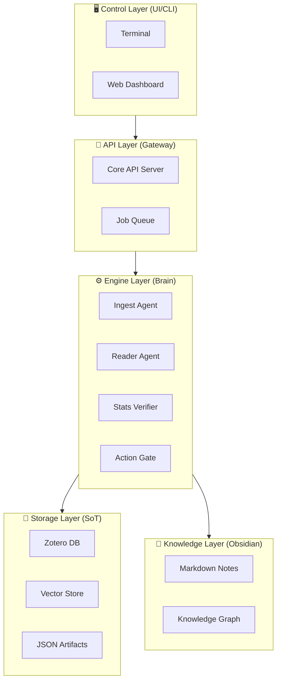

# 📘 The Book of PaperPipe: Director's Cut
*(완전 정복 가이드 — 심화편)*

> **"지루한 논문 검색은 기계에게, 인간은 위대한 발견에 집중하라."**
> — PaperPipe 창립 선언문

안녕하세요! **PaperPipe 연구소**에 오신 것을 환영합니다.
이 문서는 단순한 사용자 매뉴얼이 아닙니다. PaperPipe가 **왜** 이렇게 설계되었는지, 그 이면에 숨겨진 **철학**과 **아키텍처**를 파헤치는 **'감독판(Director's Cut)'** 가이드입니다.

---

## 1. 🚀 Phase 0: 부스팅 스토리 (The Origin)

PaperPipe가 처음부터 똑똑했을까요? 아닙니다.
우리는 시스템을 본격 가동하기 전에 **"AI를 가르치는 AI"**를 먼저 만들었습니다. 이것이 바로 **Phase 0: Bootstrapping**입니다.

### 🐣 "교사가 학생을 가르치다" (Cross-Teacher Validation)
초기 PaperPipe(Student, Llama-3)는 실수가 잦았습니다. 그래서 우리는 **두 명의 선생님**을 모셨습니다.
1.  **Teacher-1 (Editor):** 학생이 추출한 데이터를 고성능 클라우드 LLM(GPT-4o)이 교정합니다. (정답지 생성)
2.  **Teacher-2 (Auditor):** 교정된 정답조차 또 다른 LLM(Claude 3.5 Sonnet 등)이 "정말 맞아?"라고 채점합니다.

이 혹독한 **교차 검증(Cross-Validation)**을 통과한 **"Golden Example(황금 데이터)"** 50개를 모아 학생(Student)에게 주입했습니다. 덕분에 8B 모델(Student)도 **Few-Shot Learning**을 통해 순식간에 박사급 성능을 내게 된 것이죠.

---

## 2. 🏛️ 시스템 아키텍처 (The 5-Tier Structure)

PaperPipe는 단순히 파이썬 파일 몇 개가 아닙니다. 견고한 **5계층 구조**로 이루어져 있습니다.



1.  **Level 1 (Storage):** Zotero(논문 원본)와 Vector DB(임베딩)는 변경 불가능한 **진실의 원천(Source of Truth)**입니다.
2.  **Level 2 (Knowledge):** Obsidian은 사람이 읽고 생각하는 **지식의 층(Knowledge Layer)**입니다.
3.  **Level 3 (Engine):** 실제 일꾼들(Agents)이 거주하는 곳입니다.
4.  **Level 4 (API):** 외부 세계와 통신하는 관문입니다.
5.  **Level 5 (Control):** 당신이 시스템을 지휘하는 조종석입니다.

---

## 3. 🛡️ Action Gate 철학 (The Philosophy of Gates)

왜 PaperPipe는 논문을 바로 저장하지 않고 귀찮게 검문을 할까요?
**"쓰레기를 넣으면 쓰레기가 나온다 (Garbage In, Garbage Out)"**는 AI의 대원칙 때문입니다.

### 🚦 The Gatekeeper's Logic
`processor.py`에는 엄격한 **Action Gate**가 작동합니다.

1.  **Safety First (Retraction Check):** 좀비(철회된 논문)는 입구컷입니다. 아무리 좋은 논문도 철회되었다면 연구를 오염시킵니다.
2.  **Confidence is Key (확신도):**
    *   **Auto-Approve (`Conf >= 0.8`):** 믿을 만하다. 통과! ✅
    *   **Quarantine (`Conf < 0.5`):** "말이 안 되는데?" 격리 구역으로 보냅니다. 환각(Hallucination) 방지용 감옥입니다. 🚨
    *   **Escalation (`Review Needed`):** "중요해 보이는데 확신이 없어." 이때는 **상급자(The Professor/GPT-4o)**를 호출해 2차 심사를 받습니다.

이 게이트 덕분에 당신의 Obsidian 서재는 항상 **청정 구역**으로 유지됩니다.

---

## 4. 🧪 비밀 실험실 (Secret Lab): Stats Verification Agent

PaperPipe의 가장 야심 찬 기능, **"통계 검증 요원(The Verifier)"**을 소개합니다.
(`src/agents/stats_agent.py`)

### "문과생 AI는 가라, 이과생 AI가 온다"
기존 LLM은 숫자에 약했습니다. "p-value가 0.04니까 유의하다"라고 말만 할 뿐, 그 숫자가 진짜인지는 몰랐죠.
The Verifier는 다릅니다.

1.  **Code-Based Reasoning:** 논문 속 표(Table)를 읽어 `Pandas DataFrame` 코드로 변환합니다.
2.  **Sandbox Execution:** 직접 Python 코드를 짜서 `scipy.stats.ttest_ind`를 돌려봅니다.
3.  **Consistency Check:**
    *   "저자가 p=0.03이라고 했는데, 내가 계산하니 0.5인데?" -> **Flagged** 🚩
    *   "표준편차(SD)가 평균보다 큰데 정규분포를 가정했어?" -> **Review Needed** ⚠️

### 📦 Docker Sandbox (격리된 놀이터)
AI가 제멋대로 코드를 실행하면 위험하겠죠?
그래서 이 모든 과정은 **Docker Sandbox** (`src/sandbox/docker_runner.py`) 라는 투명 감옥 안에서 이루어집니다. 인터넷도 끊기고, 파일 시스템도 잠긴 절대 안전 구역입니다.

---

## 5. 🧠 Obsidian Knowledge Layer

단순히 마크다운 파일을 만드는 것이 아닙니다. **지식 그래프(Knowledge Graph)**를 구축합니다.

*   **Smart Linking:** 
    *   PaperPipe는 논문의 `Tags`와 `Vector Similarity`를 분석해, "이 논문은 저 논문과 관련이 있어"라며 자동으로 링크(`[[Note Link]]`)를 걸어줍니다.
*   **Idempotency (멱등성):**
    *   같은 논문을 열 번 `run` 해도 파일이 열 개 생기지 않습니다. 기존 노트의 특정 섹션(`## AI Summary`)만 스마트하게 업데이트합니다.

---

## 6. 연구원을 위한 맥가이버 칼 (CLI Tools)

마지막으로, 당신을 위한 도구 모음입니다.

*   **`python -m paperpipe.cli run`**: **"오늘의 업무 시작!"** (일일 파이프라인 가동)
*   **`python -m paperpipe.cli doctor`**: "PaperPipe야, 아픈 데 없니?" (환경/API/연결 상태 종합 검진)
*   **`python -m paperpipe.cli organize [경로]`**: "파일 정리 좀 해줘." (PDF 자동 리네이밍)
*   **`python -m paperpipe.cli stats`**: "나 논문 얼마나 읽었지?" (읽기 상태 통계)

---

## 7. 🧪 비밀 실험실 (The Secret Lab)

일반적인 연구원들은 출입할 수 없는, PaperPipe의 **실험적 기능(Experimental Features)**들이 개발되고 있는 곳입니다. (`src/agents/` & `src/sandbox/`)

### 🧬 The Verifier (통계 검증 요원)
"이 논문의 p-value가 정말 맞게 계산된 걸까?"
LLM이 단순히 텍스트만 읽는 것이 아니라, 직접 **검증 코드(Python)**를 작성해서 계산해봅니다.
*   **Code-Based Reasoning:** 논문 속 표(Table) 데이터를 `Pandas` 코드로 변환하고, 통계 공식(`scipy`)을 돌려봅니다.
*   **Interval Consistency:** 신뢰구간(CI)과 표준편차(SD)가 통계적으로 아귀가 맞는지 깐깐하게 따져봅니다.

### 📦 Docker Sandbox (격리된 놀이터)
AI가 제멋대로 코드를 실행하면 위험하겠죠?
그래서 이 모든 과정은 **Docker Sandbox** (`src/sandbox/docker_runner.py`) 라는 투명 감옥 안에서 이루어집니다. 인터넷도 끊기고, 파일 시스템도 잠긴 절대 안전 구역입니다.

---

## 8. 🗺️ 연구소 지도 (Directory Map)

PaperPipe라는 가상의 연구소가 실제 컴퓨터 안에서는 어떻게 생겼는지 지도로 확인해 봅시다.

```text
paperpipe/
├── 📂 src/              # [엔진룸] AI 직원들이 일하는 곳
│   ├── processor.py     # 공장장 (전체 흐름 관리 + Action Gate)
│   ├── llm_provider.py  # 통역사 (OpenAI/Ollama와 대화)
│   ├── agents/          # [비밀 실험실] Stats Verifier 등 특수 요원
│   └── zotero.py        # 사서 (Zotero 연동)
├── 📂 storage/          # [창고] 결과물이 쌓이는 곳
│   ├── state.db         # 장부 (누가 합격/불합격인지 기록 - SQLite)
│   └── export/          # 출하 대기실 (.ris 파일)
├── 📂 logs/             # [블랙박스] 모든 사건 사고가 기록되는 곳
├── .env                 # [금고] API 키 등 비밀번호 보관
└── config.yaml          # [제어판] 검색 키워드, AI 모델 설정
```

> **👨‍💻 공부 포인트:**
> 프로그램은 보통 **로직(Source Code)**과 **데이터(Storage)**, 그리고 **설정(Configuration)**을 분리해서 관리합니다. 이것을 **'관심사의 분리(Separation of Concerns)'**라고 합니다.

---

## 9. 🎛️ 제어 센터 (Control Room)

코드를 전혀 몰라도, `config.yaml`을 통해 PaperPipe의 행동을 바꿀 수 있습니다.

*   **키워드 변경:** `search.slots.clinical.query` 부분만 고치면 됩니다.
*   **엄격함 조절:** `confidence_thresholds.high`를 `0.9`에서 `0.7`로 낮추면 더 많은 논문이 통과됩니다.
*   **모델 변경:** `llm.mode`를 `"hybrid"`, `"local"`, `"cloud"` 중 하나로 선택하세요.

> **👨‍💻 공부 포인트:**
> 변경될 가능성이 있는 값은 하드코딩하지 않고 외부 설정 파일로 빼는 것이 **유지보수성**을 높이는 핵심입니다.

---

## 10. 🩹 응급 처치 키트 (Troubleshooting)

*   **증상: `Connection Refused`**
    *   **진단:** "Student(Llama-3)가 꺼져 있습니다." -> **처방:** `ollama serve`
*   **증상: `Rate Limit Exceeded`**
    *   **진단:** "Professor(GPT-4o)가 과로 중입니다." -> **처방:** `timeout_seconds` 늘리기
*   **증상: `JSON Decode Error`**
    *   **진단:** "Student가 횡설수설했습니다." -> **처방:** Gatekeeper가 알아서 처리했으니 안심하세요.

> **👨‍💻 공부 포인트:**
> 에러는 실패가 아닙니다. PaperPipe는 **예외 처리(Exception Handling)**를 통해 시스템이 멈추지 않고 회복하도록 설계되었습니다.

---

## 11. 📖 신입을 위한 용어 해설집 (Mini Dictionary)

*   **임베딩 (Embedding):** 단어를 숫자로 바꿔서 '의미'를 계산하는 기술.
*   **토큰 (Token):** AI가 글을 읽는 단위 (대략 단어의 0.7배).
*   **할루시네이션 (Hallucination):** AI의 거짓말. (그래서 Cross-Check가 필수입니다!)
*   **멱등성 (Idempotency):** 여러 번 실행해도 결과가 달라지거나 중복되지 않는 성질.

---

### 감독의 말 (Director's Note)

PaperPipe는 완성된 소프트웨어가 아니라, **진화하는 유기체**입니다.
Phase 0에서 시작해 5-Tier 구조를 갖추고, 이제는 스스로 코드를 검증하는 단계까지 왔습니다.

이 여정에 합류하신 것을 환영합니다.
이제 터미널을 열고, 당신만의 연구 파트너를 깨워보세요.

```bash
python -m paperpipe.cli run


*Good luck, Researcher!* 🚀
