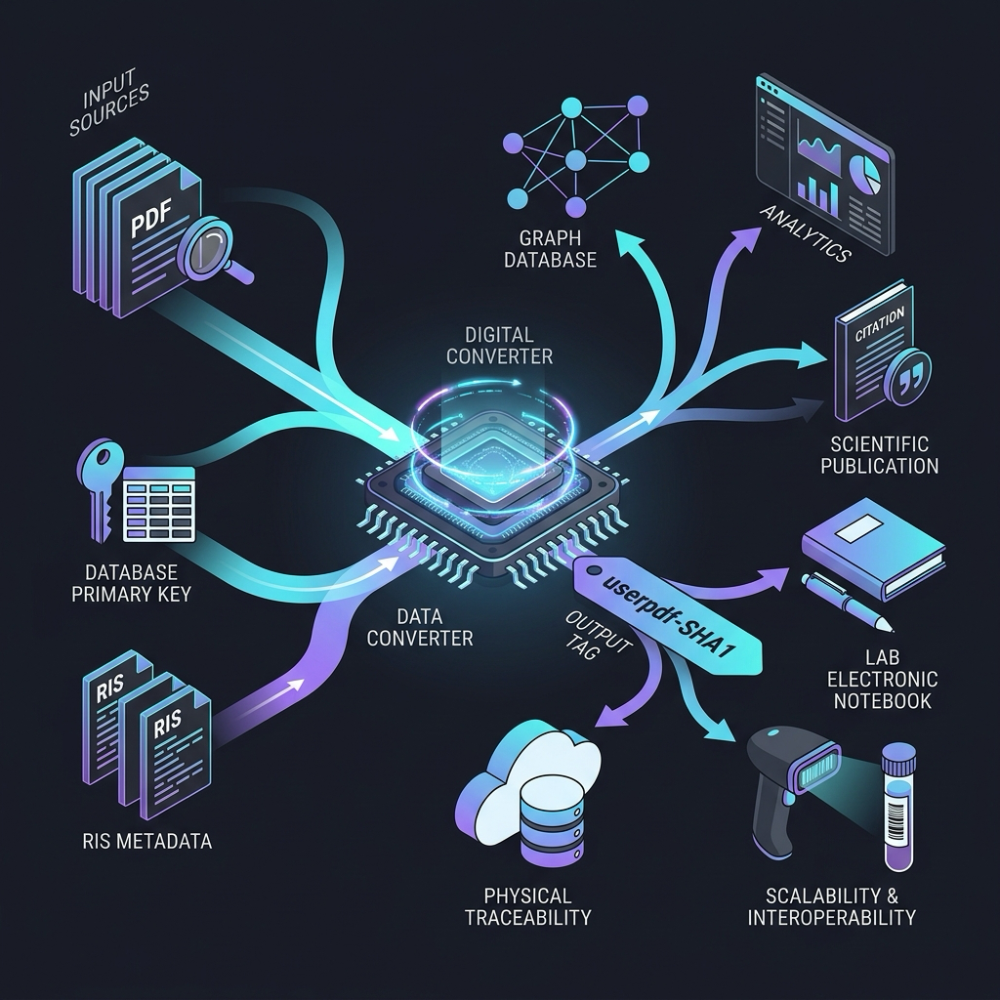
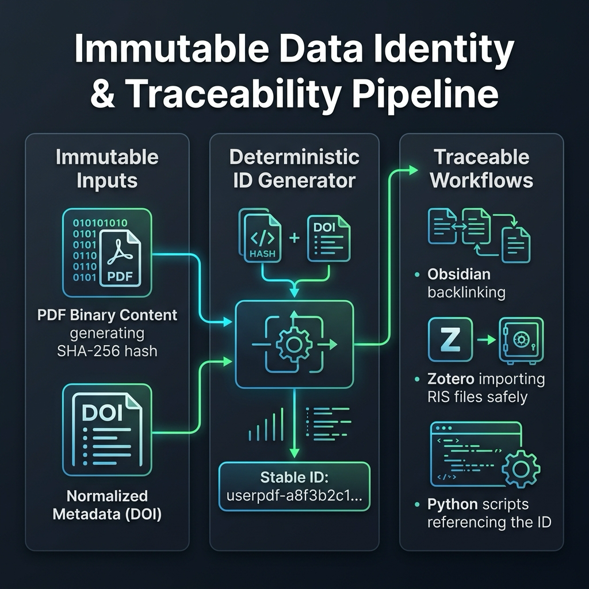

# 안티그래비티 제안: 데이터 식별자 발급 및 추적성 확보 방안 (개정판)

본 문서는 PaperPipe 시스템의 학술 데이터(PDF 및 서지 메타데이터) 식별용 고유 식별자(`userpdf-[Hash]`) 발급 체계에 대한 검토 내용과 실제 코드베이스 현황, 장기적인 확장성(Scalability) 및 물리적 추적성(Traceability) 확보를 위한 개선안, **데이터베이스 및 동기화 설계 결함**, **AI 기반 논문 검토 및 게이팅 기준(Gating Criteria)의 정밀 진단**, **인프라/성능 병목 요인**, 그리고 **마크다운 프론트매터(Frontmatter) 스키마 불일치 문제**를 정리한 통합 제안서입니다.

---

## 1. 실제 코드베이스 현황 분석 (Ground Truth)

현재 PaperPipe 코드베이스를 분석한 결과, 제안된 구조의 많은 부분이 이미 최적화된 방식으로 구현되어 있습니다.

### ① PDF 임포트 식별자 생성 방식
* **파일 위치:** [paper_notes.py](file:///Users/jangseongjin/paperpipe/backend/routers/paper_notes.py#L982-L983)
* **현황:** 사용자가 로컬 PDF를 업로드하면, 시스템은 파일명이나 데이터베이스 일련번호가 아닌 **PDF 파일 바이너리 내용 전체에 대한 SHA-1 해시값**을 생성하여 앞 16자리를 활용합니다.
  ```python
  digest = hashlib.sha1(payload).hexdigest()
  paper_id = f"userpdf-{digest[:16]}"
  ```
* **평가:** 파일명이 변경되거나 데이터베이스 인스턴스가 달라지더라도 동일한 PDF 파일이라면 **항상 동일한 식별자**를 도출하는 결정론적(Deterministic)이고 불변인(Immutable) 설계가 이미 적용되어 있습니다.

### ② DOI 기반 중복 방지 및 병합 (Idempotency)
* **파일 위치:** [db_utils.py](file:///Users/jangseongjin/paperpipe/src/db_utils.py#L380-L389)
* **현황:** `save_paper_state` 호출 시, 새로 임포트하려는 PDF의 DOI가 기존 데이터베이스에 존재하는 논문의 정규화된 DOI와 일치하면, 기존에 저장되어 있던 `paper_id`로 자동 병합 및 업데이트 처리가 수행됩니다.
  ```python
  if "paper_id" in columns and "doi" in columns and doi_value:
      cursor.execute(
          "SELECT paper_id, doi FROM papers WHERE doi IS NOT NULL AND paper_id <> ?",
          (identifier,),
      )
      for existing in cursor.fetchall():
          if normalize_doi(str(existing["doi"] or "")) == doi_value and existing["paper_id"]:
              identifier = str(existing["paper_id"])
              break
  ```

### ③ Zotero 연동 식별자 체계
* **파일 위치:** [db_utils.py](file:///Users/jangseongjin/paperpipe/src/db_utils.py#L610)
* **현황:** Zotero와 연동된 항목은 Zotero의 `citationKey`(예: 저자명+연도)를 `paper_id`로 취급하며, 마찬가지로 DOI 매핑을 통해 로컬 PDF 임포트 내역과 유기적으로 동기화됩니다.

---

## 2. 검토 의견 및 아키텍처 비교

### 사용자 제안안 vs 현재 구현 방식 비교

| 비교 항목 | 사용자 제안안 (DS PK, 파일명, RIS 조합) | 현재 코드베이스 방식 (PDF 콘텐츠 해시 + DOI 정규화) |
| :--- | :--- | :--- |
| **식별자 안정성** | **취약:** PDF 파일명이 바뀌거나 RIS 메타데이터 오타를 수정하면 해시가 변경되어 기존 링크(`[[userpdf-hash]]`)가 깨짐. | **매우 우수:** 파일 이름이나 경로가 바뀌어도 PDF 본문 자체가 변경되지 않으면 ID가 영구히 유지됨. |
| **분산 Scalability** | **불가:** DB PK(Auto-increment ID)는 데이터베이스마다 다르므로 분산 환경이나 협업 시 충돌 발생. | **완벽 보장:** 중앙 DB 없이 분산된 각 환경에서 동일한 PDF 파일을 분석해도 항상 일치하는 ID 발급. |
| **메타데이터 편차** | **취약:** 가져온 곳에 따라 RIS 파일 서식이 다르면 다른 해시가 생성됨. | **안전:** 표준 식별자인 DOI를 정규화하여 중복 매핑 및 병합 도구로 활용. |

### 최종 결론 및 제안
현재 코드베이스의 **"PDF 바이너리 해시(SHA-1 16자) + DOI 정규화 병합"** 구조가 사용자 제안안(DB PK, 파일명 기반)보다 설계 결합도(Decoupling) 및 분산 확장성 측면에서 훨씬 뛰어난 실질적인 모범 사례(Best Practice)입니다. 

따라서 신규 툴을 개발하거나 연동할 때는 **기존 코드베이스 방식(콘텐츠 해시 기반 발급 및 DOI 역참조)을 표준 규격으로 채택**할 것을 강력히 제안합니다.

---

## 3. 구조도 아키텍처

### 1단계 제안 구조 (기존 설계 기반 흐름)
기존의 가변성/종속성 한계가 존재하기 전, 직관적인 입력 기반의 발급 흐름도입니다.



### 2단계 제안 구조 (불변성 확보 개선 설계 - 현재 코드베이스 사상 반영)
가변 요소(파일명, 로컬 PK)를 제거하고 PDF 본문 해시와 정규화된 DOI를 조합하여 불변성과 상호 운용성을 확보한 실제 코드베이스 기반의 개선 아키텍처입니다.



---

## 4. 연동 시 주의 및 안전 규칙 (Safety Constraints)

1. **Zotero DB 직접 쓰기 금지 (Master Rule 준수)**
   * Zotero에 고유 식별자를 기록할 때는 `zotero.sqlite` 파일을 직접 수정해서는 안 됩니다.
   * `export/` 폴더에 고유 ID(`userpdf-hash`)가 포함된 `.ris` 또는 `.bib` 파일을 생성한 뒤 Zotero가 이를 가져오도록(Import) 설계해야 DB 오염을 방지할 수 있습니다.
2. **Obsidian Wiki-link의 네이티브 연동 한계와 개선 방안**
   * **현재 코드 분석:** [storage.py](file:///Users/jangseongjin/paperpipe/src/skills/storage.py#L210-L238)와 [paper_notes.py](file:///Users/jangseongjin/paperpipe/backend/routers/paper_notes.py#L861) 확인 결과, Python 백엔드 내부에서는 노트를 찾기 위해 frontmatter의 `id` 필드를 정상 검색합니다. 하지만, markdown 노트 생성 시 `aliases` 리스트에는 오직 논문 제목(`title`)만 포함됩니다.
   * **문제점:** 사용자가 Obsidian 앱 안에서 `[[userpdf-hash]]`와 같은 wiki-link로 해당 논문 노트를 가리키려 할 때, Obsidian 인덱서에 해당 식별자가 별칭(alias)으로 지정되어 있지 않으므로 **새로운 빈 노트 생성을 유도하거나 링크가 정상 연결되지 않습니다.**
   * **개선안:** [paper_notes.py:861](file:///Users/jangseongjin/paperpipe/backend/routers/paper_notes.py#L861)에서 markdown 생성 시 **`aliases` 리스트에 `paper_id`를 함께 추가**하도록 변경해야 합니다.
     ```python
     # 변경 전
     "aliases": [title]
     
     # 변경 후 (Obsidian 네이티브 별칭 지원)
     "aliases": [title, paper_id]
     ```

---

## 5. 추가 발견 아키텍처 결함 및 충돌 (Additional Architectural Gaps)

실제 시스템의 동기화 및 쿼리 동작을 정밀 분석한 결과, 아래와 같은 추가적인 결함과 충돌 지점이 식별되었습니다.

### ① PDF 직접 임포트와 Zotero 연동 간의 DOI 충돌 (HTTP 409) 현상
* **파일 위치:** [paper_notes.py:1001-1006](file:///Users/jangseongjin/paperpipe/backend/routers/paper_notes.py#L1001-L1006)
* **내용:** 사용자가 이미 Zotero 연동을 통해 서지 정보를 가져와 DB에 DOI 정보가 등록된 상태에서, 동일한 논문의 PDF 파일을 마우스 드래그 등으로 직접 임포트(`import-pdf`)하려고 하면 아래 예외가 발생하며 업로드가 완전히 차단됩니다.
  ```python
  existing_paper_id = _find_imported_paper_id_by_doi(doi)
  if existing_paper_id and existing_paper_id != paper_id:
      raise HTTPException(
          status_code=409,
          detail=f"A paper with DOI {doi} already exists.",
      )
  ```
* **문제점:** 동일 논문인데 임포트 경로가 달라 ID가 불일치(`zotero:citationKey` vs `userpdf-hash`)하게 되고, 결국 PDF 파일을 기존 논문에 병합/연결하지 못한 채 사용자에게 오류만 반환하는 심각한 UX 장벽이 존재합니다.
* **개선 제안:** 409 에러를 반환하는 대신, 이미 존재하는 DOI의 레코드가 있다면 해당 레코드(`existing_paper_id`)를 유지하면서 PDF 업로드 처리를 진행하고 물리적 경로 정보를 기존 데이터에 업데이트(Merge)해 주어야 합니다.

### ② 로컬 파일 경로 기반 ID 생성과 콘텐츠 해시 ID의 이중성
* **파일 위치:** [identity.py:34-37](file:///Users/jangseongjin/paperpipe/src/services/identity.py#L34-L37)
* **내용:** CLI 환경이나 파일 실행 콘텍스트(`make_runtime_paper_id`)에서 로컬 PDF 파일 경로를 통해 식별자를 파싱할 때, 파일 내용 해시가 아닌 **물리적 파일 경로 문자열을 해싱**하여 `file:{path_hash}` ID를 부여합니다.
  ```python
  if lowered.startswith("file:"):
      value = text.split(":", 1)[1].strip()
      stable = hashlib.sha1(value.encode("utf-8")).hexdigest()[:16]
      return f"file:{stable}"
  ```
* **문제점:** 백엔드 API 업로드를 거친 파일은 `userpdf-{content_hash}`를 가지지만, 로컬에서 경로로 직접 실행한 분석 작업은 `file:{path_hash}`를 가져 다른 ID 체계를 가집니다. 동일한 논문 파일에 대해 시스템이 **서로 다른 아티팩트 폴더 및 분석 결과를 별도로 관리**하게 되는 일관성 문제가 발생합니다.
* **개선 제안:** 파일 경로를 받아 ID를 만들 때도 가능하면 파일의 바이너리를 직접 SHA-1/SHA-256 해시하여 `userpdf-{content_hash}`로 통일하거나 최소한 두 ID 간의 별칭 맵을 보관해야 합니다.

### ③ 데이터베이스 쿼리 비효율성 (메모리 로딩 루프)
* **파일 위치:** [paper_notes.py:920-941](file:///Users/jangseongjin/paperpipe/backend/routers/paper_notes.py#L920-L941)
* **내용:** `_find_imported_paper_id_by_doi` 함수는 DOI가 존재하는 중복 논문을 확인하기 위해 DB에 존재하는 **모든 논문 레코드를 메모리로 한 번에 불러온 후** Python 루프 내에서 정규화 및 비교 연산을 수행합니다.
  ```python
  cursor.execute("SELECT paper_id, doi FROM papers WHERE doi IS NOT NULL")
  for row in cursor.fetchall():
      if normalize_doi(str(existing["doi"] or "")) == doi_value: ...
  ```
* **문제점:** 논문 데이터베이스가 수천~수만 건 이상으로 증가할 경우, 단순 PDF 하나를 임포트할 때마다 막대한 메모리와 CPU 낭비가 발생하여 성능이 지수적으로 저하됩니다.
* **개선 제안:** 데이터베이스 저장 시점부터 DOI를 반드시 완전히 소문자화 및 특수문자가 정규화된 상태(`normalize_doi`가 완료된 값)로만 인서트하도록 제약을 걸고, 인덱싱된 `doi` 컬럼에 대해 `SELECT paper_id FROM papers WHERE doi = ?` 쿼리 한 번으로 즉시 인덱스 조회가 가능하도록 DB 조회 레이어를 개선해야 합니다.

### ④ Zotero RIS 내보내기 동시성(Race Condition) 및 `ris_path` 스키마 비일관성 문제
* **파일 위치:** [zotero.py:8-19](file:///Users/jangseongjin/paperpipe/src/zotero.py#L8-L19) 및 [db_utils.py:84](file:///Users/jangseongjin/paperpipe/src/db_utils.py#L84)
* **내용:** `export_to_ris` 함수는 데이터 분석 완료 시 Zotero 연동을 위해 RIS 데이터를 공용 일별 파일(`{today}_import.ris`)에 추가(append) 방식으로 기록합니다.
* **문제점:**
  1. **동시성 충돌 (Race Condition):** 배치(Batch) 처리나 멀티프로세스로 논문 여러 개가 병렬 분석될 때, 동일한 파일에 동시 접근하여 쓰기를 수행하기 때문에 RIS 포맷이 뒤엉키거나 깨지는 현상이 발생할 수 있습니다.
  2. **Orphan Schema (방치된 DB 스키마):** SQLite 데이터베이스 스키마에는 `ris_path TEXT` 컬럼이 기획 단계부터 할당되어 있었으나, 실제 `save_paper_state` 구현 시 해당 인자 입력 및 저장 처리 부분이 완전히 누락되어 비어 있는 필드로 유지되고 있습니다.
* **개선 제안:** `export_to_ris`가 모든 데이터가 담긴 하나의 공용 파일 대신 개별 논문 고유의 파일(`export/ris/{paper_id}.ris`)을 독립적으로 생성하게 하고, 그 파일 경로를 `save_paper_state` 호출 시 데이터베이스 `ris_path` 필드에 영구 저장해야 합니다.

### ⑤ 수집 경로에 따른 마크다운 프론트매터(Frontmatter) 스키마 불일치 문제
* **파일 위치:** [obsidian.py:106-116](file:///Users/jangseongjin/paperpipe/src/obsidian.py#L106-L116) (get_template_study) 및 [obsidian.py:256-266](file:///Users/jangseongjin/paperpipe/src/obsidian.py#L256-L266) (get_template_trial)
* **내용:** 수동 PDF 업로드 경로(`import-pdf`)로 생성된 마크다운에는 `id: paper_id` 프로퍼티가 정상 생성되지만, 스크리닝 분석 파이프라인에서 자동으로 노트를 생성해주는 두 템플릿 코드에는 `id` 필드가 아예 빠져 있습니다.
* **문제점:** 이종 파이프라인을 거치며 프론트매터 데이터 스키마의 일관성이 무너집니다. 특히 DOI가 존재하지 않는 논문의 경우, Obsidian 노트 파일명이 수정되면 `id` 값마저 부재하여 추후 백엔드가 이 노트를 마스터 DB 레코드와 매핑할 때 식별 실패를 유발합니다.
* **개선 제안:** [obsidian.py](file:///Users/jangseongjin/paperpipe/src/obsidian.py)의 노트 빌드 템플릿에서도 프론트매터 생성 시 `id: paper.get('paper_id')` 필드를 필수적으로 주입하도록 통일해야 합니다.

---

## 6. AI 기반 논문 검토 및 게이팅 기준(Gating Criteria) 정밀 진단

기준을 코드로 구현해 일관된 반복(Repeatability)이 가능해졌으나, 코드 내 판정 논리의 완성도가 부족할 경우 **잘못된 판정을 정교하게 반복**하는 기계적 오판 문제가 발생할 수 있습니다.

### ① LLM 점수 편차(Drift)와 고정 임계값 필터의 충돌
* **파일 위치:** [gates.py:64-71](file:///Users/jangseongjin/paperpipe/src/gates.py#L64-L71) 및 [config.yaml:38-40](file:///Users/jangseongjin/config.yaml#L38-L40)
* **내용:** LLM이 논문 분석 후 부여하는 신뢰도 점수가 설정값(`high: 0.90`, `low: 0.70`)과 고정 비교되어 게이팅 결정이 내려집니다.
  ```python
  def _confidence_decision(self, confidence: float, reasons: List[ReasonCode]) -> GateDecision:
      if confidence >= self.high_threshold:
          return GateDecision.APPROVED
      if confidence < self.low_threshold:
          return GateDecision.QUARANTINED
      return GateDecision.PENDING_REVIEW
  ```
* **문제점:** LLM의 점수 분배는 모델 종류(Ollama Llama3 vs OpenAI GPT-4o), 온도(Temperature) 및 프롬프트의 미세 수정에 크게 의존합니다. 특정 업데이트 후 LLM이 전반적으로 후한 점수(예: 평균 0.95 이상)를 반환하면 **불량 데이터 자동 승인 폭발**이 발생하고, 반대로 짠 점수를 주면 **모든 데이터가 격리(Quarantine)**되어 자동화 흐름이 붕괴됩니다.
* **개선 제안:** 고정 점수 외에 **필수 추출 정보(Claims)의 개수**, **검증 근거(Evidence)의 신뢰성** 등을 가중합산(Weight Sum)하거나 다각도 다면 평가(Score Card) 모델로 로직을 정교화해야 합니다.

### ② 형식적 검증(Key Presence) vs 실질적 검증(Value Validation)의 간극
* **파일 위치:** [gates.py:81-85](file:///Users/jangseongjin/paperpipe/src/gates.py#L81-L85)
* **내용:** 필수 필드 누락 검사 시 JSON 응답 딕셔너리에 단순 키(Key)가 존재하는지만 체크합니다.
  ```python
  required = ["confidence", "soft_tags", "hard_tags"]
  missing = [field for field in required if field not in analysis]
  ```
* **문제점:** LLM이 파싱 오류나 정보 미추출로 인해 `soft_tags: []` (빈 리스트), `hard_tags: {}` (빈 딕셔너리)와 같이 **빈 껍데기 값**을 리턴하더라도 게이팅 엔진은 이를 유효한 응답으로 인지하고 최종 APPROVED 상태로 통과시킬 수 있습니다.
* **개선 제안:** 필수 정보 필드의 실제 데이터 개수가 최소 기준을 만족하는지(예: `len(soft_tags) >= 1`), 내부 주요 속성이 비어있지 않은지 검증하는 **벨류 유효성 체크(Value Validation)** 단계가 강제되어야 합니다.

### ③ 수집 쿼리(Search Query)와 AI 판정 질문(Research Question)의 지향성 불일치
* **파일 위치:** [config.yaml:49-62](file:///Users/jangseongjin/config.yaml#L49-L62)
* **내용:** 각 주제 슬롯(Slot)마다 검색엔진에 던지는 `query` 문자열과 LLM이 논문을 판정하는 `research_question` 지침이 다르게 코딩되어 있습니다.
  * 예: `methods` 슬롯의 수집 쿼리에는 오가노이드(`organoid`), 바이오소재(`biomaterial`) 등 광범위한 실험 재료가 잡히도록 되어 있으나, 정작 AI 판정 가이드라인은 측정 방식 개선 및 샘플 핸들링 개선 위주로 협소하게 정의되어 있습니다.
* **문제점:** 수집된 재료 중심의 논문들이 AI의 기능 중심 가이드라인을 통과하지 못해 불필요한 보류(`PENDING_REVIEW`) 상태로 적체되거나 격리되어 스크리닝 효율이 하락합니다.
* **개선 제안:** 수집 쿼리의 목표 인벤토리 범위와 LLM의 의사결정 연구 질문 가이드라인을 일관되게 정합(Alignment)시키는 설계 싱크 조정이 주기적으로 이루어져야 합니다.

---

## 7. 추가 시스템 및 인프라 관점 정밀 진단 (Additional Infrastructure Diagnostics)

코드가 작동하는 비동기 런타임 및 파일 시스템 수준에서 병목 및 동기화 괴리 요소를 발굴했습니다.

### ① FastAPI 비동기 이벤트 루프 블로킹 문제 (CPU-bound PDF parsing in async route)
* **파일 위치:** [paper_notes.py:2273-2285](file:///Users/jangseongjin/paperpipe/backend/routers/paper_notes.py#L2273-L2285)
* **내용:** `/import-pdf` 라우트는 `async def` 비동기 함수로 선언되어 있으나, 내부에서 매우 무거운 CPU 연산 및 동기식 파일 I/O를 수행하는 `import_pdf_payload` 함수를 직접(Directly) 호출합니다.
* **문제점:** `import_pdf_payload` 안에서는 PDF 텍스트 추출(PyPDF 최대 16페이지 스캔), 마크다운 작성, SQLite 쓰기 등이 한꺼번에 실행됩니다. FastAPI의 단일 스레드 비동기 루프에서 이 같은 무거운 동기 함수가 호출되면 **연산이 끝날 때까지 서버 전체가 일시 동결(Freeze)되어 다른 모든 API 요청에 전혀 응답하지 못하게 됩니다.**
* **개선 제안:** 동기 함수 실행부를 `anyio.to_thread.run_sync` 또는 `asyncio.to_thread.run_sync`를 사용해 백그라운드 스레드 풀로 격리하여 실행시켜야 합니다.

### ② Obsidian 수동 수정 사항의 SQLite DB 역동기화 부재 (Obsidian-to-SQLite Data Drift)
* **파일 위치:** [paper_notes.py:1127-1186](file:///Users/jangseongjin/paperpipe/backend/routers/paper_notes.py#L1127-L1186) (`_build_index` 참고)
* **내용:** 백엔드는 프론트엔드 출력을 위해 Obsidian 마크다운 파일을 로드하여 임시 JSON 인덱스를 업데이트하지만, 사용자가 Obsidian 앱 안에서 노트의 frontmatter 속성(예: `status`, `doi`, `tags`)을 직접 수정하거나 파일을 삭제하더라도 이 변경 사항이 PaperPipe 마스터 DB인 `state.db` SQLite 테이블로 역방향 반영(Sync-Back)되지 않습니다.
* **문제점:** Obsidian 파일 시스템과 데이터베이스 테이블 간의 **데이터 괴리(Data Drift)**가 영구히 누적됩니다. 상태 관리가 이원화되어 배치 파이프라인 작동 시 심각한 상태 혼선이 생길 수 있습니다.
* **개선 제안:** 파일 와처(Watcher)에서 Obsidian 노트 수정 감지 시, 프론트매터 파싱 내용을 파싱하여 SQLite DB에 실시간 `UPDATE papers`를 적용하는 양방향 동기화 핸들러를 보완해야 합니다.

### ③ 프로세서 실패 복구 회복력 및 찌꺼기 파일 누적 문제 (Partial writes & orphan run directories)
* **파일 위치:** [processor.py:611-665](file:///Users/jangseongjin/paperpipe/src/processor.py#L611-L665) (`run` 루프 참고)
* **내용:** 분석 프로세스(`PaperProcessor`) 구동 시 3번의 연속적인 예외 실패(`consecutive_failures >= 3`)가 발생하면 전체 수집 루프가 전면 중단(Abort)됩니다.
* **문제점:**
  1. **배치 탄력성 부족:** 특정 PDF 파일 깨짐 등으로 연속 실패가 발생하면, 이후 대기 중인 정상 논문들까지 수집이 전면 중단되는 문제를 초래합니다.
  2. **Orphan Artifacts (남겨진 임시 디렉토리):** 분석 도중 예외가 발생해 프로세스가 튕기면, `storage/artifacts/[paper_id]/[run_id]/`에 쓰이다 만 불완전한 부분 아티팩트 파일과 빈 폴더가 영구적으로 지워지지 않고 누적되어 스토리지 용량을 차지합니다.
* **개선 제안:** 중단 스레시홀드를 완화하고 예외 처리 catch 블록에서 작업이 중단된 아티팩트 디렉토리를 깨끗하게 롤백(Clean-up)하는 복구 회복력(Resiliency) 메커니즘을 추가해야 합니다.

### ④ Zotero 일괄 동기화(Bulk Sync) 시 SQLite 락(Locked) 발생 위험
* **파일 위치:** [db_utils.py:610-734](file:///Users/jangseongjin/paperpipe/src/db_utils.py#L610-L734) (`sync_zotero_to_db` 함수)
* **내용:** Zotero에서 추출된 다량의 논문 목록 데이터를 SQLite DB에 마이그레이션할 때, 대량의 조회 및 쓰기 연산을 루프로 실행한 후 맨 마지막에 일괄적으로 `conn.commit()`을 수행합니다.
* **문제점:** 동기화되는 논문 개수가 많아질수록 단일 트랜잭션이 차지하는 잠금(Write Lock) 시간이 비정상적으로 길어집니다. 이 동기화 트랜잭션이 작동하는 긴 시간 동안, 다른 사용자가 웹 프론트엔드를 통해 읽기 상태를 바꾸거나 PDF를 업로드하려고 하면 SQLite 기본 타임아웃(5초)을 초과하여 `sqlite3.OperationalError: database is locked` 예외와 함께 프로세스가 뻗게 됩니다.
* **개선 제안:** 대량 동기화 수행 시 일정 개수(예: 30~50개 단위)마다 분할 커밋(Batch Commit)을 수행해 데이터베이스 잠금을 주기적으로 반환하고, DB 연결 모듈([db_utils.py:278](file:///Users/jangseongjin/paperpipe/src/db_utils.py#L278))에서 `sqlite3.connect` 호출 시 `timeout=30.0`과 같이 커넥션 busy timeout을 안전하게 높여 설정해야 합니다.

### ⑤ DOI 표현 포맷의 미세 불일치로 인한 DB 조회 누락
* **파일 위치:** [db_utils.py:19-23](file:///Users/jangseongjin/paperpipe/src/db_utils.py#L19-L23) (`_normalized_doi_or_none`) 및 [paper_notes.py:603-611](file:///Users/jangseongjin/paperpipe/backend/routers/paper_notes.py#L603-L611) (`_normalize_doi`)
* **내용:** `db_utils`는 수집된 DOI 정보에서 접두사를 완전히 제거한 순수 번호(`10.xxxx/yyyy`)만 데이터베이스 `doi` 컬럼에 보관합니다. 반면, Obsidian 인덱서 등 백엔드 일부 모듈은 DOI를 출력할 때 항상 URL 프로토콜 접두사(`https://doi.org/10.xxxx/yyyy`)가 붙은 완성형 문자열로 인덱싱합니다.
* **문제점:** 외부 툴이나 내부 추가 로직에서 정규화 함수를 우회하여 DB 쿼리를 다이렉트로 날릴 때, 접두사 유무(`10.xxxx` vs `https://doi.org/...`) 차이로 인해 분명 존재하는 논문임에도 매핑에 실패하여 데이터가 중복 인서트되는 불일치 오류가 발생할 수 있습니다.
* **개선 제안:** 내부 모든 컴포넌트 간에 DOI를 활용할 때 항상 명시적인 `normalize_doi` 헬퍼 함수를 필수 거치도록 규정(Lint 및 가이드)하거나, 데이터베이스 저장 값과 프론트매터 출력 규격을 동일한 완전형태(혹은 순수번호형태)로 통일해야 합니다.

---

## 8. 추가 발굴 이슈: 예외 처리 및 파이프라인 스키마 분기

### ① 파이프라인 출력 경로에서의 사일런트 예외 삼킴 (Silent Exception Swallowing)
* **파일 위치:** [processor.py:1058-1081](file:///Users/jangseongjin/paperpipe/src/processor.py#L1058-L1081)
* **내용:** `process_daily_slots` 함수 내 Obsidian 노트 저장, RIS 내보내기, DB 최종 저장이라는 세 가지 핵심 출력 단계가 각각 독립적인 `try/except Exception: pass` 블록으로 감싸여 있습니다.
  ```python
  try:
      save_paper_to_obsidian(row, config, extraction=clinical_extraction)
  except Exception:
      pass
  try:
      export_to_ris(row, Path(config.paths.export_dir))
  except Exception:
      pass
  try:
      save_paper_state(...)
  except Exception:
      pass
  ```
* **문제점:** 분석 결과(tags, clinical_data, confidence)가 성공적으로 산출되었더라도 Obsidian 노트 생성 실패, RIS 내보내기 실패, 또는 DB 저장 실패 시 **어떤 로그도 기록되지 않은 채 조용히 넘어갑니다.** 결과적으로 논문이 DB에 존재하지 않는데도 UI에서 `APPROVED` 상태처럼 보이거나, Obsidian 노트가 생성되지 않은 채 파이프라인만 정상 완료된 것으로 보고되는 **불완전 상태(Phantom Success)**가 발생합니다. 특히 `save_paper_state` 실패는 파이프라인 재실행 시 동일 논문의 중복 처리를 유발합니다.
* **개선 제안:** 출력 단계 실패 시 `logger.warning` 또는 `logger.error`로 반드시 오류를 기록하고, `save_paper_state`는 실패 시 재처리 큐에 등록하도록 처리해야 합니다. 최소한 `except Exception as exc: logger.warning("...", exc)` 형태로 모든 `pass`를 교체해야 합니다.

### ② 두 파이프라인 간 `feedback_json` 스키마 분기 문제 (Dual-pipeline Schema Drift)
* **파일 위치:** [processor.py:753-756](file:///Users/jangseongjin/paperpipe/src/processor.py#L753-L756) (`PaperProcessor._step_analyze`) vs [processor.py:1036-1054](file:///Users/jangseongjin/paperpipe/src/processor.py#L1036-L1054) (`process_daily_slots`)
* **내용:** PaperPipe에는 두 개의 독립적인 처리 파이프라인이 공존합니다.
  - **`PaperProcessor` (상태 머신 방식):** `_step_analyze`에서 태깅 결과 전체를 그대로 `json.dumps(tags_data)`하여 `feedback_json`에 저장합니다. 이후 `_step_gate`에서 이를 역파싱하여 `PaperTagging.model_validate(analysis)`로 검증합니다.
  - **`process_daily_slots` (레거시 배치 방식):** `feedback_json`에 태깅 데이터 외에도 `selection`(후보 선택 근거), `escalation`(에스컬레이션 결과), `clinical_data`, `intake_override_log` 등 다수의 추가 필드를 병합하여 저장합니다.
* **문제점:** 두 파이프라인이 생성한 `feedback_json`의 구조가 완전히 다릅니다. `reconcile_approved_decisions`([db_utils.py:887](file:///Users/jangseongjin/paperpipe/src/db_utils.py#L887))나 뷰어 레이어 등 `feedback_json`을 소비하는 코드가 두 포맷 중 어느 한 가지를 가정하고 파싱하면, 나머지 파이프라인 산출물에서 **키 미스 또는 잘못된 필드 해석**이 발생합니다. 특히 레거시 파이프라인은 게이트 로직(GateEngine)을 완전히 우회하고 임계값 비교만으로 상태를 결정하여, 두 경로에서 동일 논문에 대해 다른 판정이 내려질 수 있습니다.
* **개선 제안:** `feedback_json`의 최상위 스키마를 명시적인 Pydantic 모델(`FeedbackPayload`)로 고정하고, 태깅/에스컬레이션/임상 데이터 등을 각각 명명된 서브 필드로 분리하여 두 파이프라인 모두 동일한 스키마를 준수하도록 통일해야 합니다. 레거시 파이프라인의 직접 임계값 분기도 `GateEngine.evaluate()`를 공유 경유하도록 리팩토링해야 합니다.

### ③ 기관 프록시 URL 하드코딩 (Hardcoded Institutional Proxy)
* **파일 위치:** [institutional_access.py:6](file:///Users/jangseongjin/paperpipe/src/institutional_access.py#L6)
* **내용:** 기관 도서관 프록시 URL이 소스 코드에 직접 박혀 있습니다.
  ```python
  PROXY_PREFIX = "https://proxy.example.ac.kr/_Lib_Proxy_Url/"
  ```
* **문제점:** 이 값은 `config.yaml`이나 환경 변수에서 로드되지 않고 코드에 박혀 있습니다. 배포 환경이 달라지거나(다른 대학·기관) 프록시 URL이 변경될 경우 코드를 직접 수정해야 합니다. 더 심각하게는 **타 연구자가 이 코드베이스를 그대로 사용하면 모든 논문 요청이 경북대 도서관 프록시를 통해 라우팅**되는 의도치 않은 동작이 발생합니다. 또한 이 값이 API 응답이나 프론트매터에 포함될 경우 **개인 기관 정보가 외부에 노출**될 수 있습니다.
* **개선 제안:** `config.yaml`에 `system.institutional_proxy_url` 필드를 추가하거나 환경 변수 `PAPERPIPE_INSTITUTIONAL_PROXY`로 읽도록 이동해야 합니다. 설정이 없으면 `None`을 반환하여 프록시 없이 직접 접근하도록 폴백해야 합니다.

### ④ `src.db` 레거시 모듈 이중 DB 경로 문제 (Legacy Module Dual DB Path Risk)
* **파일 위치:** [db.py:6-9](file:///Users/jangseongjin/paperpipe/src/db.py#L6-L9), [db.py:283-352](file:///Users/jangseongjin/paperpipe/src/db.py#L283-L352)
* **내용:** `src.db`는 "deprecated" 처리되어 `src.db_utils`로 위임하도록 설계되었으나, `save_paper_state` 함수가 여전히 `src.db`에 **독립 구현체**로 존재합니다. 두 구현체는 동일한 논리를 담고 있지 않습니다. `src.db.save_paper_state`는 `doi` 컬럼과 `paper_id` 컬럼에 동일 값(`identifier`)을 삽입하고, 오류 시 `logger.error` 대신 `print(f"DB Error: {e}")`로만 기록합니다.
* **문제점:** 레거시 경로가 살아 있는 한 `src.db`를 임포트하는 코드(현재 tests 3개 및 `src/db.py` 내부 `init_db` 호출)가 다른 경로로 DB에 쓰는 상황이 발생합니다. 두 경로가 **같은 식별자를 다른 방식으로 INSERT**하면 `ON CONFLICT` 해석이 달라져 데이터 무결성 오류가 발생할 수 있습니다. 또한 `print` 기반 오류 기록은 로그 집계 시스템에 포착되지 않습니다.
* **개선 제안:** `src.db.save_paper_state`를 완전히 제거하거나 `src.db_utils.save_paper_state`의 직접 래퍼로 교체해야 합니다. `db.py`가 deprecated임을 선언했다면 프로덕션 코드 경로에서 이 모듈의 독립 구현체가 호출되지 않도록 `DeprecationWarning`을 모든 함수 진입점에 추가하고 CI에서 경고를 오류로 처리해야 합니다.

### ⑤ 비서메트릭 점수의 `venue_score` 상수 하드코딩 (Bibliometric Dead-Weight Score)
* **파일 위치:** [ranking.py:58](file:///Users/jangseongjin/paperpipe/src/ranking.py#L58)
* **내용:** `BibliometricScorer`의 가중 합산 점수(`manual_rank_score`) 계산 시 저널 점수(`venue_score`)가 항상 `0.5` 상수로 고정되어 있습니다.
  ```python
  venue_score = 0.5  # Todo: Map ISSN to SJR list if available
  ```
* **문제점:** 가중치 설정(`config.yaml`의 `ranking.bibliometrics.weights.venue: 0.2`)이 아무 효과 없이 항상 `0.5 * 0.2 = 0.1`의 상수 기여값을 만들어 냅니다. 즉, **저널 점수는 실질적으로 비교·변별 기능 없이 모든 논문 점수에 동일한 상수를 더하는 바이어스**로만 작동합니다. 더 심각한 점은, `config.yaml`에서 `venue` 가중치를 높여도 점수가 달라지지 않는다는 것을 사용자가 알 수 없다는 것입니다. 즉 **설정이 동작하는 것처럼 보이지만 실제로는 동작하지 않는 거짓 설정(Phantom Config)**입니다.
* **개선 제안:** 단기적으로 `venue_score`를 `0.0`으로 변경하거나 venue 가중치 항목 자체를 계산에서 제외해 현재 상태를 명확히 표현해야 합니다. 또는 `venue_score = 0.5`를 `# STUB: always 0.5 until ISSN→SJR mapping is implemented` 형태의 명시적 주석과 함께 경고 로그를 출력해야 합니다. 장기적으로는 ISSN-SJR 매핑 테이블을 도입하거나 OpenAlex의 `source.apc_price` 또는 `concepts.level` 정보로 대체해야 합니다.

### ⑥ `watcher.py` 파일 핸들러의 블로킹 `time.sleep(1)` (Blocking File Handle Wait)
* **파일 위치:** [watcher.py:42](file:///Users/jangseongjin/paperpipe/src/watcher.py#L42)
* **내용:** `PaperFileHandler.on_created` 이벤트 핸들러에서 파일 핸들이 해제될 때까지 `time.sleep(1)`로 무조건 1초를 대기합니다.
  ```python
  time.sleep(1)  # Wait briefly to ensure file handle is released
  ```
* **문제점:** watchdog 라이브러리는 이벤트를 워커 스레드에서 동기 실행합니다. 핸들러 내부의 `time.sleep(1)`은 해당 워커 스레드 전체를 1초간 블록합니다. 단일 워커 스레드 모드에서 **초당 1개 이상의 PDF가 감지되면 뒤에 들어오는 이벤트들이 큐에 쌓이며 처리 지연**이 발생합니다. 또한 파일 핸들 해제 여부를 전혀 검증하지 않으므로 1초 대기 후에도 파일이 잠겨 있으면 파싱 단계에서 에러가 납니다. 반면 `downloads_watcher.py`는 `_wait_for_stable_file()`로 파일 크기·mtime 기반 안정성 확인을 올바르게 구현하고 있어 **두 watcher 간 불일치**가 존재합니다.
* **개선 제안:** `watcher.py`의 `time.sleep(1)`을 `downloads_watcher.py`의 `_wait_for_stable_file()` 로직으로 교체하거나 공유 유틸리티로 추출해야 합니다. 최소한 파일 핸들이 실제로 해제되었는지 `open(path, 'rb')` 시도로 검증 후 진행해야 합니다.

---

## 8b. 추가 발굴 이슈: 수집·다운로드·내보내기 계층

### ⑦ ArXiv 수집 시 `doi` 필드에 ArXiv ID 대입 (DOI 필드 오염)
* **파일 위치:** [fetch/arxiv.py:69](file:///Users/jangseongjin/paperpipe/src/fetch/arxiv.py#L69)
* **내용:** ArXiv 논문을 수집할 때 `Paper` 스키마의 `doi` 필드에 `arxiv_id`(예: `2401.12345`)를 그대로 저장합니다.
  ```python
  doi=arxiv_id, # ArXiv doesn't always have DOI, use ID
  ```
* **문제점:** ArXiv ID는 DOI가 아닙니다. 이 값이 `doi` 컬럼에 저장되면 다음 문제가 연쇄됩니다:
  1. `normalize_doi()`로 조회 시 ArXiv ID와 실제 DOI가 혼용되어 **중복 방지 로직이 오작동**합니다. 동일 논문의 PubMed 버전과 ArXiv 버전이 별도 레코드로 삽입됩니다.
  2. `retraction.py`의 `check_retraction(doi)`에 ArXiv ID가 전달되면 Crossref는 항상 404를 반환합니다.
  3. `institutional_access.py`의 프록시 URL 생성 시 `https://doi.org/2401.12345` 형태의 잘못된 URL이 생성됩니다.
  4. RIS 내보내기의 `DO` 필드에 비표준 식별자가 들어가 Zotero 임포트 품질이 저하됩니다.
* **개선 제안:** ArXiv DOI는 `https://doi.org/10.48550/arXiv.{arxiv_id}` 형식으로 존재합니다. ArXiv API 응답의 `arxiv:doi` 링크가 있으면 실제 DOI를 사용하고, 없으면 `doi=None`으로 두고 `arxiv_id`는 별도 필드나 `paper_id` 스키마에만 저장해야 합니다.

### ⑧ Worker의 `asyncio.run()` 중첩 호출 위험 (Nested Event Loop Risk)
* **파일 위치:** [jobs/worker.py:195](file:///Users/jangseongjin/paperpipe/src/jobs/worker.py#L195)
* **내용:** `Worker.process_job()`은 동기 컨텍스트(스레드)에서 `asyncio.run(run_deepread_job(...))`을 호출합니다.
* **문제점:** FastAPI는 `uvicorn`의 메인 이벤트 루프 위에서 동작합니다. 워커 스레드가 별도 스레드에서 실행되므로 `asyncio.run()`은 기술적으로 허용되지만, **워커가 FastAPI 앱과 동일 프로세스에서 실행될 경우**(현재 구조에서 실제로 그럴 가능성 있음) `asyncio.get_event_loop()`가 이미 실행 중인 루프를 반환해 `RuntimeError: This event loop is already running`이 발생합니다. 또한 `run_deepread_job` 내부에서 FastAPI 의존성(`Depends`) 또는 `lifespan` 리소스에 접근하면 별도 이벤트 루프에서 접근하는 상황이 되어 **세션·연결 풀 공유 문제**가 발생합니다.
  현재 코드에는 `TypeError` 호환성 우회 로직이 3단계로 구현되어 있는데([worker.py:196-213](file:///Users/jangseongjin/paperpipe/src/jobs/worker.py#L196-L213)), 이는 워커-러너 계약이 지속적으로 드리프트하고 있음을 보여주는 신호입니다.
* **개선 제안:** 워커를 완전히 별도 프로세스(subprocess) 또는 `ProcessPoolExecutor`에서 실행하거나, `anyio.from_thread.run_sync` / `asyncio.get_event_loop().run_until_complete` 중 프레임워크-권장 방식으로 교체해야 합니다. 워커-러너 인터페이스는 Pydantic 스키마로 고정하여 TypeError 우회 코드를 제거해야 합니다.

### ⑨ `retraction.py`의 철회 감지 로직 오류 (Retraction Check Logic Bug)
* **파일 위치:** [retraction.py:64-66](file:///Users/jangseongjin/paperpipe/src/retraction.py#L64-L66)
* **내용:** Crossref API의 `assertions` 필드에서 `is-retracted` 값을 확인할 때 `assertion.get("value") is True`로 파이썬 `bool`과 비교합니다.
  ```python
  if assertion.get("name") == "is-retracted" and assertion.get("value") is True:
  ```
* **문제점:** Crossref API는 JSON 응답에서 `"value": true`를 반환하는데, Python의 `json.loads()`는 이를 `True`로 올바르게 변환합니다. 그러나 일부 Crossref 응답에서 `"value"` 필드가 `"true"` **문자열**로 반환되는 경우가 있습니다. 이 경우 `"true" is True`는 `False`이므로 **철회된 논문이 철회되지 않은 것으로 잘못 판정**됩니다. 또한 `check_retraction_on_ingest: bool = False`가 기본값이고 실제 파이프라인에서 이 플래그를 체크하는 코드가 `src/` 내에 존재하지 않습니다(테스트 파일에만 존재). 즉 **철회 감지 기능 자체가 파이프라인에 연결되어 있지 않은 미완성 기능**입니다.
* **개선 제안:** `assertion.get("value") is True` 비교를 `str(assertion.get("value", "")).lower() == "true" or assertion.get("value") is True`로 수정해야 합니다. 또한 `check_retraction_on_ingest` 플래그를 `processor.py`의 인제스트 경로에서 실제로 읽어 `check_retraction(doi)`를 호출하도록 파이프라인에 연결해야 합니다.

### ⑩ `exporter.py`의 타임존 인식 없는 날짜 비교 (Naive Datetime Comparison)
* **파일 위치:** [exporter.py:753-756](file:///Users/jangseongjin/paperpipe/src/exporter.py#L753-L756)
* **내용:** Obsidian 노트의 스마트 덮어쓰기 로직에서 DB의 `updated_at` 문자열과 파일의 `mtime`을 비교합니다.
  ```python
  dt_db = datetime.fromisoformat(db_updated_str)
  ts_db = dt_db.timestamp()
  if ts_db > file_mtime:
      should_write = True
  ```
* **문제점:** `datetime.fromisoformat()`은 Python 3.10 이하에서 타임존 접미사(`+00:00`, `Z`)를 지원하지 않으며, Python 3.11 이상이어도 `db_updated_str`이 타임존 없는 naive datetime(`"2024-01-15 09:30:00"`)으로 저장되어 있으면 `dt_db`는 로컬 시간으로 해석됩니다. 반면 `file_mtime`은 UTC epoch입니다. 사용자의 시스템 시간대가 UTC가 아니면(예: KST=UTC+9) **최대 9시간의 비교 오차**가 발생하여:
  - DB가 실제로 최신임에도 파일이 덮어쓰여지지 않거나
  - 파일이 더 최신임에도 불필요하게 덮어쓰여지는 오작동이 발생합니다.
  또한 비교 실패 시 `except Exception: pass`로 silently skip되어 노트가 갱신되지 않아도 알 수 없습니다.
* **개선 제안:** DB에 저장 시 `updated_at`을 UTC ISO 8601 형식(`datetime.now(timezone.utc).isoformat()`)으로 통일하고, 비교 시에는 `datetime.fromtimestamp(file_mtime, tz=timezone.utc)`를 사용하여 양쪽 모두 타임존-인식(aware) 객체로 비교해야 합니다.

---

## 9. 향후 확장 및 개선 가능성 (Future Scalability & Improvements)

시스템이 대규모 데이터셋으로 성장하고 타 플랫폼과의 상호운용성을 확대하기 위해 아래와 같은 확장 및 개선 방안을 추가 검토할 수 있습니다.

### ① 해시 충돌 방지를 위한 식별자 크기 확장
* **현황:** 현재 코드는 SHA-1 해시의 앞 16자리(64비트)를 잘라서 식별자로 사용하고 있습니다.
* **개선 가능성:** 데이터가 수백만 건 단위로 확장될 경우 생일 역설(Birthday Paradox)에 의한 해시 충돌 확률이 아주 낮게나마 존재합니다. 이를 방지하기 위해 **SHA-256** 알고리즘을 도입하고 슬라이스 길이를 **24~32자리**로 늘리는 것을 고려할 수 있습니다.
* **예시:** `userpdf-f1a7d6e8b2c4d5e6...` (256비트 해시의 일부 추출)

### ② 텍스트 정규화 기반 유사도 해시(Semantic Deduplication) 도입
* **현황:** 현재 방식은 파일 내 바이너리 바이트 하나만 달라도(예: 다운로드 시 포함된 출판사 워터마크, 메타데이터 인코딩 차이) 다른 ID가 부여됩니다.
* **개선 가능성:** 논문의 첫 페이지 또는 특정 색인 정보의 텍스트(Text Content)만 추출하여 공백 및 인코딩을 정규화한 후 해싱하는 **텍스트 유사 해시(SimHash / MinHash)** 기술을 적용하면 물리적 파일 상태가 미세하게 다르더라도 동일한 논문으로 묶어주는 스마트 중복 방지가 가능해집니다.

### ③ PDF 미보유 상태의 가상 식별자 연동
* **현황:** PDF 파일이 없이 서지 메타데이터(Zotero Citation Key 등)만 존재하는 논문은 `citationKey`가 임시 ID로 동작하며, PDF 유무에 따라 식별 구조가 다릅니다.
* **개선 가능성:** PDF가 없는 메타데이터 전용 레코드는 결정론적으로 `meta-[DOI_Hash]` 형식의 식별자를 임시 부여하고, 향후 PDF가 확보되었을 때 백링크와 DB 레코드를 깨뜨리지 않고 `userpdf-[PDF_Hash]`와 다대일(N:1) 매핑 또는 부모-자식(Parent-Child) 관계로 병합할 수 있는 **유연한 매핑 구조**로 개선할 수 있습니다.

### ④ 다중 버전 관리(Multi-Version & File Binding)
* **현황:** 아카이브(arXiv) 프리프린트 버전과 정식 출판 저널 버전은 내용이 유사해도 파일 해시가 달라 별도의 레코드로 생성됩니다.
* **개선 가능성:** 논문 식별자에 **버전 속성(Version Property)**을 추가하여 상위 개념의 `master_paper` 그룹 아래에 복수의 프리프린트 및 최종 저널 PDF 해시 ID를 자식 객체로 묶는 **버전 체인 구조**를 형성합니다.

### ⑤ 로컬 퍼스트(Local-first) 보안 동기화 최적화
* **현황:** 사용자가 자신의 로컬 환경에서 기기 간 동기화를 진행할 때, 메타데이터와 메모리가 안전하게 싱크되어야 합니다.
* **개선 가능성:** 파일 내용 자체를 전달하지 않더라도 식별자가 결정론적 해시로 이루어져 있으므로, 암호화된 메타데이터 및 노트만 클라우드를 통해 공유하고 각 로컬 기기에서는 동일한 PDF가 감지되는 순간 자동으로 노트를 매핑해 주는 **제로 노리지(Zero-Knowledge) 동기화** 설계로 응용이 가능합니다.
