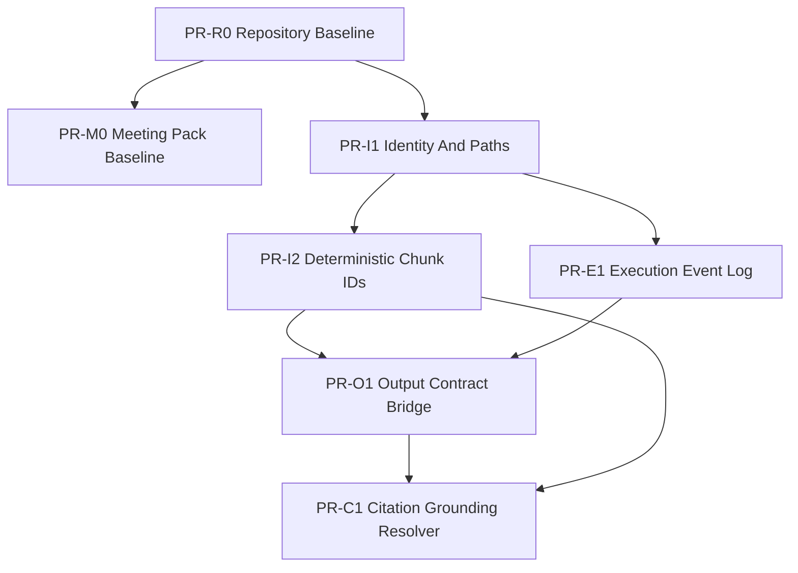

# Audit-Driven Roadmap

Status: Execution roadmap derived from 2026-03-13 baseline audits  
Date: 2026-03-13  
Scope: repository baseline adoption, identity/pathing, event logging, output contract convergence, and citation grounding
Current entrypoint: `docs/reports/Current_Docs_Posture_2026-04-17.md`
Current use: historical roadmap context for the 2026-03 baseline split; do not use as the current implementation queue or runtime SSOT.

## 0. Purpose

This roadmap translates the current audit set into an implementation order that matches the actual codebase.

It is explicitly grounded in the following verified state:

- execution baseline is green
- repository baseline is not yet frozen
- core runtime still depends on legacy `agent_artifacts`
- event observability is file-log centric
- citation grounding is evidence-aware but not chunk-verified

This roadmap is designed to avoid rework.

Important refinement after dependency-cone review:

- `Meeting Pack` should not be folded into `PR-R0`
- its runtime slice depends on untracked `schemas/meeting_pack`, `schemas/skills`, `schemas/chat`, `skills/storage`, `profile_metadata`, and `research_dna_store`
- therefore baseline-freeze work must be split into:
  - a narrow `PR-R0` for runtime-path + audit baseline
  - a separate `PR-M0` for Meeting Pack baseline adoption

## 1. Baseline Assumptions

### 1.1 What is stable enough to build on

- FastAPI backend and SQLite job queue
- worker-driven deepread execution
- artifact bundle and Obsidian routes
- Paper Notes / StructuredPaperState layer
- Meeting Pack and Research DNA product surfaces

### 1.2 What is still transitional

- repository baseline adoption for untracked runtime files
- identity/pathing standardization
- execution event model
- output contract convergence
- citation resolver and deterministic evidence links

### 1.3 Core architectural rule for the next phase

Do not try to solve memory hooks, output convergence, and citation grounding in one PR.

Recent external reference reviews do not change this execution order.

Treat them only as bounded inputs in a `sidecar / fallback / benchmark / dataset / reference` frame, unless new repository-grounded evidence justifies a roadmap change.

The order matters:

1. freeze current repository baseline
2. standardize identities and path helpers
3. add execution event persistence additively
4. converge output contracts through bridges
5. introduce citation grounding resolver on top

## 2. Recommended PR Sequence

## PR-R0: Repository Baseline Adoption

### Goal

Freeze the currently passing narrow execution baseline into the repository baseline.

### Why first

Until the runtime/test baseline files are tracked, every later structural PR sits on moving ground.

Execution note:

- the exact include/exclude boundary for this PR is defined in `/Users/jangseongjin/paperpipe/docs/PR_R0_Baseline_Adoption_Manifest_2026-03-13.md`

### Scope

Adopt only the narrow baseline-freeze slice:

- runtime path contract
- runtime path regression tests
- audit/roadmap documents

### Non-goals

- no architecture redesign
- no schema migration
- no new features
- no Meeting Pack package adoption in this PR

### AC

- repository baseline matches the currently passing narrow execution baseline
- no untracked runtime-critical files remain in the adopted area
- the relevant targeted tests still pass unchanged

## PR-M0: Meeting Pack Baseline Adoption

### Goal

Freeze the currently passing Meeting Pack runtime slice as its own repository baseline PR.

### Why separate from `PR-R0`

Dependency review showed that Meeting Pack now depends on a much wider untracked cone than originally assumed, including:

- `/Users/jangseongjin/paperpipe/src/schemas/meeting_pack.py`
- `/Users/jangseongjin/paperpipe/src/schemas/chat.py`
- `/Users/jangseongjin/paperpipe/src/schemas/skills.py`
- `/Users/jangseongjin/paperpipe/src/skills/`
- `/Users/jangseongjin/paperpipe/src/profiles/profile_metadata.py`
- `/Users/jangseongjin/paperpipe/src/profiles/research_dna_store.py`

If that slice is absorbed into `PR-R0`, the baseline-freeze PR stops being reviewable.

Execution note:

- the exact boundary for this PR is defined in `/Users/jangseongjin/paperpipe/docs/PR_M0_Meeting_Pack_Baseline_Adoption_2026-03-13.md`

### Scope

- `backend/routers/meeting_packs.py`
- `src/meeting_packs/`
- `src/schemas/meeting_pack.py`
- the minimum transitive dependency set needed to keep Meeting Pack runtime/tests green
- Meeting Pack-specific tests

### AC

- Meeting Pack runtime and tests pass as an isolated slice
- the adopted dependency cone is explicit
- no unrelated frontend or broad product-surface expansion is bundled in the PR

## PR-I1: Identity And Path Helper Layer

### Goal

Introduce a single helper layer for runtime identity and artifact path construction.

### Why third

Event logging, contract convergence, and citation grounding all depend on stable paper/run/chunk identity, but the repository baseline needs to be frozen first.

### Scope

Add helper modules for:

- `paper_id` normalization/factory
- filesystem-safe paper directory key or equivalent path helper abstraction
- `run_id` generation rules for runtime execution
- artifact path helper functions

Minimum deliverables:

- one canonical place that builds artifact/run directories
- one canonical place that describes `paper_id` and `run_id` semantics
- removal of ad hoc `artifacts_root() / paper_id / run_id` assembly in new code paths

### Constraints

- do not break existing `/artifacts/{paper_id}/{run_id}` API routes
- keep backward compatibility for existing on-disk artifact layout unless a migration shim is added
- account for the legacy `runs` table in `/Users/jangseongjin/paperpipe/src/db.py`

### AC

- new code paths use path helpers instead of raw path concatenation
- `run_id` generation is documented and consistent for runtime jobs
- future event-log/output-resolver work can depend on the helper layer

## PR-I2: Deterministic Chunk IDs

### Goal

Replace the active `uuid4()` chunk id strategy with a deterministic chunk contract for the deepread path.

### Why separate from I1

This change affects reader evidence, indexer behavior, and future citation resolver correctness. It deserves isolated review.

### Scope

- update `/Users/jangseongjin/paperpipe/src/agents/indexer_agent.py`
- define chunk-id determinism relative to parser/chunker/config inputs
- preserve enough metadata to reconstruct page/section context

### Constraints

- do not promise cross-version chunk stability when parser/chunker logic changes unless config/version is included
- keep current retrieval/index flows functional

### AC

- same document + same parser/chunker config => same chunk ids
- reader and downstream tooling can reference stable chunk ids
- regression tests prove chunk-id stability on repeat runs

## PR-E1: Execution Event Log (Additive)

### Goal

Add a real DB-backed execution event layer without breaking current JSONL/SSE behavior.

### Why after identities

`job_events`, `user_actions`, and execution-level runs are only useful if their keys are stable and documented.

### Scope

Introduce additive tables, using a collision-safe name for execution runs, for example:

- `execution_runs`
- `job_events`
- `user_actions`

Bridge strategy:

- keep the current `jobs` table
- keep current JSONL `log_path` replay
- also persist structured event rows
- let `/jobs/{job_id}/events` and `/runs/{run_id}/timeline` evolve to prefer DB events while retaining file fallback

### Constraints

- do not reuse the legacy `runs` table name blindly
- keep existing frontend/API contracts working during migration
- do not require a full async event bus rewrite in the first PR

### AC

- job execution produces append-only structured event rows
- user actions can be persisted explicitly
- current SSE/timeline tests still pass
- file-log replay remains as compatibility fallback

## PR-O1: Output Contract Convergence Bridge

### Goal

Converge the repository onto one declared downstream output path without breaking existing consumers.

### Scope

Declare and bridge the three current layers:

- ingest canonical contract: `DocumentArtifactV2`
- deepread runtime contract: current claim/stats artifact layer
- product/viewer state contract: `StructuredPaperState`

Implementation direction:

- create one project-owned bridge from deepread claimsets into structured state
- reduce ad hoc normalization logic scattered across routers and skills runner
- add explicit schema/version identity where missing

### Constraints

- do not introduce a fourth contract family
- do not break current `claimset.resolved.json` preference behavior
- keep current Paper Notes and Obsidian routes compatible

### AC

- one documented bridge path exists from deepread artifacts to viewer/state contract
- contract version identity is explicit where downstream consumers need it
- new integrations can target the bridge instead of custom adapters

## PR-C1: Citation Grounding Resolver V1

### Goal

Add a real resolver that can verify evidence against deterministic chunks and derive citation anchors from system data instead of model guesses.

### Why last

Without stable chunk ids and an agreed output bridge, grounding work will be fragile and expensive to review.

### Scope

Resolver inputs:

- claim evidence
- chunk set / chunk lookup
- quote text

Resolver outputs:

- resolved page
- `grounded` boolean
- `resolution` code
- optional normalized-match fallback status

Product behavior:

- verified grounding should be distinguishable from approximate page hints
- unresolved citations should surface as unresolved, not silently appear grounded

### Constraints

- keep current page-based Zotero jumps working as a fallback
- do not block the entire product on perfect bbox highlighting
- do not expand into full bbox/highlight UX in the first resolver PR

### AC

- evidence can be resolved against chunk text deterministically
- citation surfaces can distinguish verified vs approximate vs unresolved
- existing unknown/review safeguards remain in place

## 3. Dependency Graph

## 4. What Not To Do Yet

Do not start with these:

- bbox-perfect highlight UX
- replacing current SSE with a completely new live event bus
- inventing another claim/evidence schema family
- treating `claimset.resolved.json` filename alone as proof of verified grounding
- large frontend citation-jump promises before resolver semantics exist

## 5. Immediate Working Recommendation

If implementation starts now, the highest-leverage order is:

1. `PR-R0`
2. `PR-M0`
3. `PR-I1`

Reason:

- these three set the floor for everything else
- they reduce rework for event logging and citation grounding
- they are narrow enough to review without dragging the whole product surface into one change set

## 6. Final Judgment

The audits show that the repository is ready for hardening, not for another round of loosely connected feature additions.

The next winning move is not "add more UX" or "add more agents".

It is to lock the baseline, standardize identity/pathing, and make chunk-backed grounding possible.
