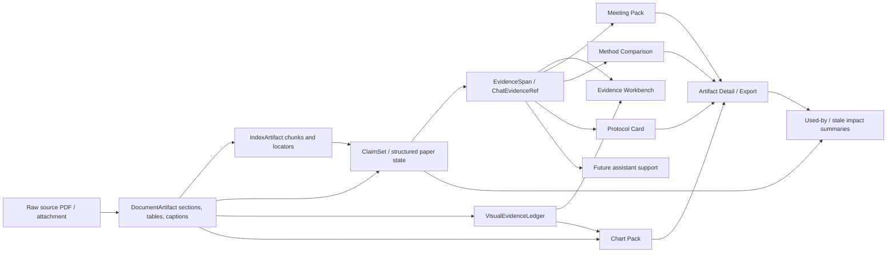

# PaperPipe Extracted Data Workflow Map

Status: Proposed workflow map
Date: 2026-05-10
Owner: Runtime/product maintainers
Canonical parent: `docs/Lattice_v3_Master_Spec.md`
Related operating note: `docs/PaperPipe_Minimum_Operating_Principles.md`
Related page architecture: `docs/PaperPipe_Page_Architecture.md`
Related chat contract: `docs/API_CHAT_CONTRACT.md`
Document map: `docs/PaperPipe_UI_Redesign_Document_Map.md`

## 1. Executive Summary

PaperPipe should treat extracted paper data as reusable evidence-linked material, not as isolated page content.

The product workflow should make this chain legible:

> raw source -> extracted document structure -> chunks/tables/figures -> claim/evidence state -> review artifacts -> downstream user-facing artifacts -> assistant/support answers.

The key design risk is not duplicate usage itself. Reuse is necessary. The risk is that repeated downstream use makes derived or generated content look like a new source of truth.

Recommendation:
- show extracted data relationships as workflow-aware relationship views, but keep canonical ownership paper/job/artifact-scoped
- reuse extracted data through explicit refs, not copied prose alone
- surface duplicate use as provenance and impact, not as generic project graph theater
- keep downstream artifacts visibly downstream from paper-level evidence state

## 2. Quick Review

- Choice count: each page should show only the relationships needed for the current task.
- Benefit: relationship views should answer "where did this value come from, where is it reused, and what breaks if it changes?"
- Next action: relationship UI should lead to inspect source, resolve evidence, repair artifact, or review downstream reuse.
- Feedback: when extraction, grounding, rerender, regeneration, or sync changes a reused item, affected surfaces should show stale or needs-review state.
- Ethics: repeated use of extracted data must not make a weak extraction look more certain.

## 3. Full Review

### P0

- Do not create a detached global truth graph that outranks paper-scoped canonical structured state.
- Do not treat copied excerpts, assistant answers, meeting slides, charts, or protocol drafts as stronger than upstream evidence refs.
- Do not silently propagate changed extracted data into downstream artifacts without stale/review cues.
- Do not hide whether a reused item is evidence-backed, artifact-backed, or merely derived.
- Do not ask the operator to manually maintain low-level relation edges during normal reading.

### P1

- Preserve stable identifiers for paper, run, claim, evidence, locator, figure/table, artifact, and version where available.
- Show reuse impact in the right rail of Paper Detail, Workbench, Figure/Table Evidence, and Artifact Detail.
- Make relationship labels layer-aware: source, extracted, canonical state, review artifact, downstream artifact, personal memory, assistant support.
- Prefer "used by" and "derived from" relationships before broad graph UI.
- Use freshness, warning density, and missing-source cues when downstream artifacts depend on stale or unresolved evidence.

### P2

- Add visual graph or lineage diagrams only after the relation inventory is reliable.
- Add cross-paper relationship views after Paper Detail and Workbench can already show local paper-level reuse well.
- Add assistant-driven relationship queries only after `/api/chat` moves beyond stub-only status.

## 4. Full Review Coverage

6P storyboard context:
- Problem: extracted data now powers reading, claim review, figures, method comparisons, meeting packs, chart packs, protocol cards, and future assistant support.
- Emotion: the researcher needs confidence that reuse did not blur provenance.
- Action: the user opens a paper, verifies a claim, inspects a figure, generates an artifact, or asks what depends on a source.
- Struggle: the same evidence can appear in many places, and generated artifacts can make it hard to see what is source-backed.
- Attempt: define relationship types, workflow transitions, UI placement, and stale/reuse rules.
- Happy Ending: the user can trace a claim, value, figure, or artifact back to source and see downstream reuse before trusting or exporting it.

BMAP:
- Motivation: high when a researcher is preparing reuse, export, meeting, protocol, or assistant-backed answer.
- Ability: improves when the product shows relationship summaries rather than requiring manual graph maintenance.
- Prompt: relationship prompts should appear at reuse moments: open review, inspect source, update affected artifact, or export with provenance.

B.I.A.S:
- Block: avoid showing every edge everywhere; use route-specific relationship summaries.
- Interpret: use consistent relationship verbs such as `derived from`, `evidence for`, `uses`, `reused by`, `stale because`, and `blocked by`.
- Act: make the next action evidence-first, not graph-navigation-first.
- Store: users should remember that PaperPipe preserves source lineage even after generating downstream artifacts.

Peak-End:
- Peak: a user clicks a reused value in a slide, chart, or protocol and reopens the original evidence span or figure.
- Pit: a downstream artifact looks polished but its source extraction is weak, stale, or missing.
- Transition: Paper Detail -> Workbench -> Artifact Detail should preserve paper, claim, evidence, and artifact context.
- End: export should leave a provenance summary and unresolved warning list.

Ethics:
- Regret: reduced when the UI prevents over-trust in repeated extracted content.
- Black Mirror: risk appears if derived outputs compound errors across many artifacts while looking authoritative.
- In Real-Life: a careful research collaborator says "this value came from here, and it is reused there."

## 5. Data Layer Map

| Layer | Current examples | Owner | Reuse role | UI stance |
| --- | --- | --- | --- | --- |
| Raw source | PDF, uploaded attachment, source URL, paper metadata | source adapter / local file | original material | preserve and reopen |
| Extracted document structure | `DocumentArtifact`, sections, tables, captions | run artifact | source-derived structure | inspectable, not source truth |
| Retrieval/index material | `IndexArtifact`, chunks, vector ids | run artifact | navigation and retrieval support | folded unless relevant |
| Canonical structured state | `.pp/<slug>/state.json`, structured paper state, claimset-like paper state | paper-scoped runtime | current evidence-linked paper state | strongest product truth layer |
| Review artifacts | `VisualEvidenceLedger`, coverage focus, gates, evidence extraction bundle | job/run/artifact lane | quality and review support | explicit non-canonical |
| Downstream user-facing artifacts | Meeting Pack, Chart Pack, Method Comparison, Protocol Card, Paper Synthesis | artifact lane | reuse/export/presentation | draft-like unless lane contract says otherwise |
| Personal memory | notes, stars, stickers, operator markers | user/operator state | resume and recall | memory, not validation |
| Assistant support | future chat answers with `ChatEvidenceRef` | future runtime | source-routed explanation | support, not canonical truth |

## 6. Core Relationship Types

Use a small relationship vocabulary before adding any graph UI:

| Relationship | Meaning | Example | UI label |
| --- | --- | --- | --- |
| `extracted_from` | derived from raw source | section text from PDF page | Extracted from source |
| `chunked_as` | retrieval/index form of text | section to chunk id | Indexed as |
| `evidence_for` | evidence span supports or contextualizes a claim | `EvidenceSpan` to claim | Evidence for |
| `located_at` | locator maps a ref to page/span/table/cell/bbox | evidence to PDF/table/figure | Located at |
| `reviewed_by` | review artifact evaluates or constrains reuse | visual ledger to figure/claim | Reviewed by |
| `uses` | downstream artifact uses source/evidence item | slide uses evidence ref | Uses |
| `reused_by` | inverse of `uses` for source detail views | evidence reused by chart pack | Reused by |
| `derived_from` | artifact or value came from upstream state/artifact | chart data snapshot from stats report | Derived from |
| `stale_because` | upstream changed after downstream output | claimset rerun after meeting pack | Stale because |
| `blocked_by` | reuse cannot proceed safely | missing source PDF or ungrounded quote | Blocked by |

Avoid adding broad generic relation labels such as `related_to`, `approved_by`, or `truth_of` until a specific lane requires them.

## 7. Current Reuse Paths

### 7.1 Reading And Review

Flow:
- raw PDF/source
- `DocumentArtifact` sections/tables
- chunks and locators
- `ClaimSet` / structured paper state
- `EvidenceSpan` refs with page, chunk, char span, table/cell, bbox, quote, rationale, grounding, and resolution
- Paper Detail and Workbench evidence anchors

Important reuse:
- Paper Detail uses extracted sections and claim/evidence refs for reading context.
- Workbench uses the same claim/evidence refs for verification and repair.
- Assistant readiness uses `ChatEvidenceRef`-style deep links but should remain stub-only until adopted.

UI must show:
- source availability
- extraction/grounding quality
- claim coverage
- unresolved/missing/conflict states
- where each claim/evidence is reused downstream

### 7.2 Figure And Table Evidence

Flow:
- raw PDF page
- extracted figure/table/caption
- `VisualEvidenceLedger`
- linked claim ids and allowed/not-allowed claim notes
- figure/table evidence page
- meeting/chart/protocol reuse candidates

Important reuse:
- a figure can support a claim, appear in a meeting pack, feed a chart pack, or become a review warning.
- table cells can become evidence spans, method comparison cells, chart pack rows, or protocol parameters.

UI must show:
- figure/table id
- source page and bbox when available
- caption and extraction version
- linked claims
- allowed versus not-allowed claims
- downstream artifacts using this visual or table

Guardrail:
- visual evidence is a review artifact with `canonical_status=non_canonical`; styling must not promote it to truth.

### 7.3 Method Comparison

Flow:
- selected paper ids
- field specs such as intervention, comparator, duration/timepoint, primary readout, sample size
- source priority: claimset, document artifact, paper note state
- row/cell values with `ChatEvidenceRef`
- markdown/CSV export

Important reuse:
- one extracted method value may appear in a comparison table, meeting pack, protocol draft, or assistant answer.

UI must show:
- value status: explicit, inferred, missing, conflict
- evidence refs per cell
- readiness and freshness
- operator overrides separately from source-backed values

Guardrail:
- comparison cells are user-facing artifact values, not canonical paper facts.

### 7.4 Meeting Pack

Flow:
- source selectors
- source items and retrieval trace
- evidence refs
- one-page summary, slides, speaker notes, questions, expected questions, next steps
- review artifacts such as visual evidence ledger
- markdown sync and regenerate strategy

Important reuse:
- the same evidence ref can power a key point, slide bullet, speaker note, expected question, and next step.
- reuse is useful, but repeated appearance should be counted as downstream reuse, not stronger evidence.

UI must show:
- source selectors and retrieval trace summary
- evidence refs attached to each reusable unit
- warning and readiness state
- whether markdown is in sync or drifted
- what source item each slide/key point depends on

Guardrail:
- `evidence_backed` readiness means evidence-linked output, not claim truth or approval.

### 7.5 Chart Pack

Flow:
- chart source ref from stats report or document table
- field mappings, filters, sort, transforms
- data snapshot
- chart definition
- render artifacts
- quality gate / warnings

Important reuse:
- extracted table cells and stats checks can be transformed into charts.
- a chart can be reused in meeting packs or exports.

UI must show:
- source kind, paper id, run id, table id when present
- transform list
- data snapshot and warning list
- render environment
- source row count

Guardrail:
- a chart render is a visualization of selected extracted data, not a stronger statistical conclusion.

### 7.6 Protocol Card

Flow:
- paper note or attachment source
- draft request
- protocol card
- protocol version
- source refs and linked paper/note ids
- validation status and version status

Important reuse:
- methods, materials, readouts, conditions, and cautions can be derived from papers or attachments.
- protocol versions may reuse paper evidence while adding internal adaptation.

UI must show:
- source kind: paper-derived, internal adaptation, or mixed
- version status and validation status
- source refs per version
- linked papers and notes
- change reason between versions

Guardrail:
- `verified_by_user` is user/lane validation, not scientific truth of the upstream paper.

### 7.7 Assistant Support

Flow:
- current screen context
- canonical structured state first
- evidence refs and locators second
- downstream artifacts as support context
- assistant answer with scope, source basis, uncertainty, and next action

Important reuse:
- assistant can help find where extracted data is used, but must not become the owner of the relationship graph.

UI must show:
- answer scope
- source basis
- uncertainty
- linked refs
- payload boundary

Guardrail:
- chat history is raw memory/support unless separately promoted through an adopted contract.

## 8. Cross-Page Workflow Rules

### 8.1 Paper Detail

Show:
- current paper state
- claim/evidence coverage
- source provenance
- downstream reuse summary: "used in 2 meeting packs, 1 chart, 1 protocol"
- stale or warning cue if downstream artifacts depend on outdated run state

Do not show:
- full graph by default
- artifact generation above evidence review

### 8.2 Evidence Workbench

Show:
- claim list and evidence refs
- source excerpts or visual/table refs
- unresolved, conflict, missing, stale, or blocked states
- per-claim downstream reuse
- repair impact: which artifacts may need review after evidence changes

Do not show:
- generated artifact actions before evidence state
- success language that implies scientific truth

### 8.3 Figure / Table Evidence

Show:
- source page, caption, bbox, table/cell ids
- linked claims
- derived values
- artifacts using the visual/table
- allowed/not-allowed claim notes

Do not show:
- interpretation as source truth

### 8.4 Artifact Detail

Show:
- upstream paper/run/source selectors
- evidence refs attached to artifact units
- source coverage and warning density
- trace/provenance timeline
- freshness against latest paper/run state
- regenerate/rerender/export behind state context

Do not show:
- export before warnings and provenance
- artifact polish as validation

### 8.5 Settings / Runtime

Show:
- whether model/provider configuration can affect extraction or regeneration
- whether external inference is disabled, local-only, or allowed by policy
- whether a rerun would use different config than the artifact's original run

Do not show:
- raw API keys
- hidden external transfer paths

## 9. Duplicate Use Rules

Duplicate use is allowed and expected when it is explicit.

Rules:
- one evidence ref may be reused by multiple claims or artifacts only if each use keeps the upstream ref.
- duplicated text in downstream artifacts should remain attached to an evidence ref or source item when it is presented as evidence-backed.
- repeated downstream appearance does not increase confidence.
- if a source extraction is corrected, downstream artifacts that used it should become stale, needs-review, or drifted.
- if evidence is missing, downstream content should be background-only, context-only, or warning-marked.
- if an artifact copies generated prose without evidence refs, it should be treated as draft/background support.

## 10. UI Relationship Patterns

### Source Chain

Use on Paper Detail, Workbench, Figure/Table Evidence, and Artifact Detail.

Pattern:
- Source PDF -> Extracted text/table/figure -> Claim/Evidence -> Review artifact -> Downstream artifact

Best UI:
- compact provenance timeline
- each node has layer and status
- clicking a node opens the relevant page or side panel

### Used By

Use on Paper Detail, claim detail, figure/table detail, and evidence detail.

Pattern:
- This claim/evidence/table/figure is used by:
  - Meeting Pack slide
  - Chart Pack chart
  - Method Comparison cell
  - Protocol Card version
  - Assistant answer draft, if future runtime exists

Best UI:
- compact list grouped by artifact family
- show stale/warning badges
- avoid graph visualization until the list is reliable

### Impact Of Change

Use when rerun, repair, edit, or regenerate may affect downstream artifacts.

Pattern:
- If this claim/evidence/table is repaired, these artifacts may need review.

Best UI:
- guarded confirmation with affected artifact count
- no automatic overwrite
- link to review affected artifacts after operation

### Evidence Coverage

Use on Paper Library, Paper Detail, Workbench, and Artifact Detail.

Pattern:
- coverage meter counts sourced items, missing refs, unresolved refs, conflicts, and stale refs.

Best UI:
- label as coverage or readiness
- never label as truth, quality, or approval

## 11. Proposed Minimal Relation Index

Do not start with a universal graph database.

First implement route-level relationship summaries from existing artifacts, such as `used by`, `derived from`, and `stale impact` lists. A derived local relation index should be considered only after the current UI audit shows that repeated route-level summaries need a shared rebuildable helper.

Minimum fields:

```text
relation_id
source_layer
source_type
source_id
relation_type
target_layer
target_type
target_id
paper_id
run_id
claim_id?
evidence_id?
locator?
artifact_family?
artifact_id?
artifact_version?
status
stale_reason?
created_from_artifact
created_at
```

Rules:
- derived index is non-canonical and rebuildable.
- source artifacts remain the owners.
- missing or ambiguous relation rows must not invent truth.
- UI may use the index for navigation, used-by summaries, stale impact, and recovery prompts.
- write paths should continue writing lane-owned artifacts first.
- the relation index must not be required before the first Paper Detail, Workbench, or Artifact Detail UI spike.

## 12. Mermaid Workflow Sketch



## 13. First PR-Sized Actions

1. Add route-level `used by` summaries in the UI grammar before implementing a graph.
2. Create a current-route audit for where `evidence_refs`, `source_items`, `review_artifacts`, and `artifact_brief` are already visible or hidden.
3. Prototype stale-impact display on Artifact Detail or Workbench before building a relation index.

## 14. Acceptance Checklist

For every relationship or workflow UI change:

- relationship source layer and target layer are visible or inferable
- canonical structured state remains stronger than downstream artifacts
- derived/review/user-facing artifacts keep non-canonical language
- duplicate use does not increase displayed confidence
- stale/review-needed states appear when upstream source changes
- operator does not need to manually curate low-level relation edges
- every export or share path carries provenance and unresolved warning context
- assistant views, if added later, show source basis and uncertainty
