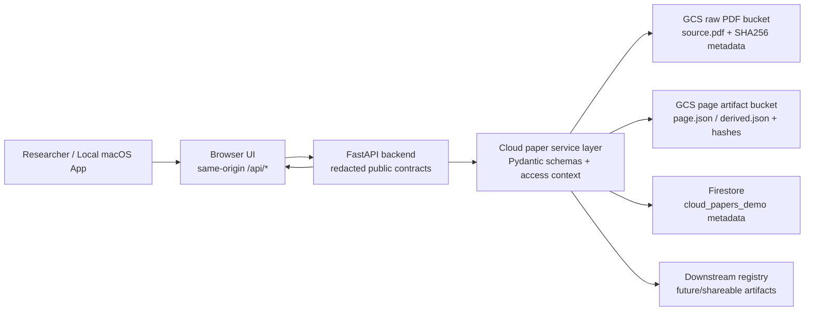
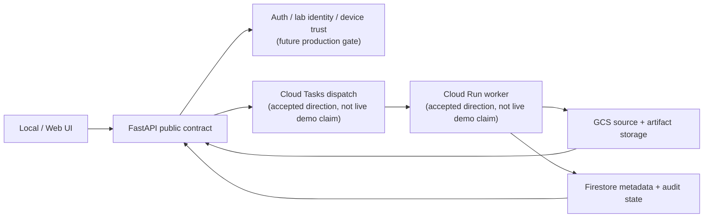

# Google Agent Challenge GCP System Architecture

Status: slide-ready architecture note
Date: 2026-06-04
Event target: Google Agent Challenge finals, 2026-06-05
Brand: Lattice

## Core Message

Lattice keeps the existing local app and FastAPI research workflow, then adds GCP as a bounded cloud-backed evidence state layer.

For teammate-facing clarification of Firestore, backend E2E, state, gate, attach, and claim boundaries, see `docs/contest/Google_Agent_Challenge_GCP_Architecture_Teammate_Note_2026-06-05.md`.

In Korean:

> GCP를 추가하면서 기존 local app과 FastAPI 기반 서비스를 그대로 유지하되, 원본 PDF와 page artifact는 GCS에, 논문 metadata와 processing state는 Firestore에 보존했습니다. 브라우저는 GCS에 직접 접근하지 않고 redacted public contract만 받기 때문에, 기존 사용 경험은 유지하면서도 단일 기기 의존성과 팀 단위 재사용의 한계를 줄이는 구조가 되었습니다.

## Problem / Limit / GCP Solution

| Existing service | Kept value | Previous limit | GCP-backed improvement |
| --- | --- | --- | --- |
| Local macOS app | Researcher can use Lattice on their own machine | Paper state can remain tied to one device | Cloud-backed paper state can be searched/opened again |
| FastAPI contract | Frontend/backend boundary remains stable | Local artifacts are hard to share across a project | Same public contract can serve GCS/Firestore-backed papers |
| Schema-backed state | Claims, evidence, uncertainty, provenance stay structured | Downstream tools may re-read or re-invent the paper | Page/derived artifacts are stored with schema versions and hashes |
| Downstream artifacts | Meeting packs, slides, figure/table context can be generated | Outputs can drift away from source evidence | Artifacts attach back to the same evidence state |
| Local-first posture | Sensitive research state is not blindly externalized | Collaboration and durability are limited | Browser receives redacted public contracts, not GCS refs or secrets |

## Current Measured Architecture



Flow:

1. The researcher keeps using the local Lattice app.
2. The browser calls same-origin `/api/*` only.
3. FastAPI handles cloud paper routes and storage adapters.
4. Upload is backend-mediated; the browser does not directly access GCS.
5. GCS stores raw PDFs and page/derived artifacts.
6. Firestore stores paper metadata and upload/processing status.
7. FastAPI returns redacted public schemas to the UI.
8. Downstream artifacts attach to evidence state without replacing canonical scientific truth.

## Production Direction



Safe claim:

> The finals gate measured GCS + Firestore + FastAPI + packaged macOS alpha proof. Cloud Run and Cloud Tasks are the accepted production worker direction, not claimed as live demo infrastructure.

## Slide 4 Draft

Headline:

> GCP keeps the current service usable while removing the single-device limit.

Body:

- Existing local app and FastAPI contracts stay intact.
- GCS stores source PDFs and page/derived artifacts with hashes.
- Firestore stores durable paper metadata and processing state.
- The browser receives only redacted public contracts.
- This enables project/lab reuse direction without claiming production sharing yet.

Visual:

```text
Local Lattice App
  -> Browser UI same-origin /api/*
  -> FastAPI redacted contract
  -> Cloud paper service layer
  -> GCS raw PDF + page/derived artifacts
  -> Firestore paper metadata/status
  -> UI search/open/inspect
```

## Do Not Overclaim

- Do not say Cloud Run or Cloud Tasks power the current demo.
- Do not say browser reads directly from GCS.
- Do not say project/lab sharing is production-ready.
- Do not say downstream artifacts become canonical scientific truth.
- Do not say production SSO/auth is already implemented.
