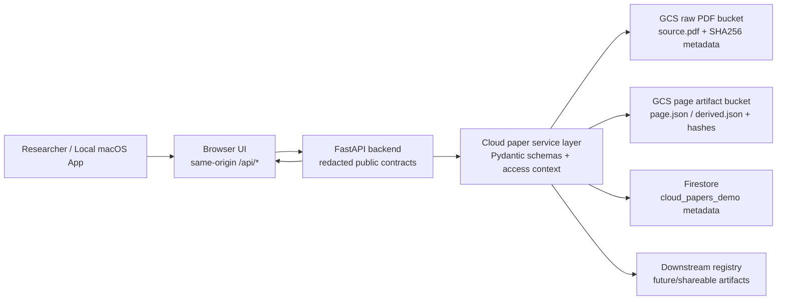
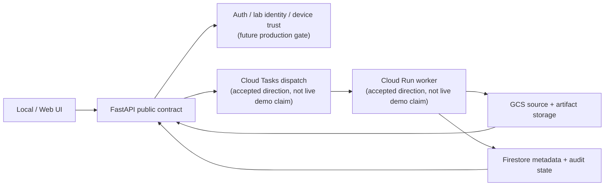

# Google Agent Challenge 본선 발표 최종 합본

Status: one-file final brief
Date: 2026-06-04
Event target: Google Agent Challenge finals, 2026-06-05
Brand: Lattice

## 0. 이 파일의 목적

이 파일 하나만 읽으면 발표자료 제작, 발표자 리허설, 수치 확인, 예상 Q&A까지 한 번에 이해할 수 있게 정리했습니다.

다른 파일들은 원본 evidence, runbook, archive, 혹은 제작 산출물입니다. 발표 준비자가 모든 파일을 읽을 필요는 없습니다.

최종 산출물 위치:

- 발표자료 초안 PPTX: `output/presentation/lattice_google_agent_challenge_finals_draft_ko_v2_accessible.pptx`
- 한국어 제작 브리프 DOCX: `output/doc/google_agent_challenge_lattice_presentation_brief_ko.docx`
- 이 합본 문서: `docs/contest/READ_THIS_ONE_FILE_Google_Agent_Challenge_2026-06-05.md`

## 1. 최종 발표의 핵심 결론

Lattice는 논문을 단순 요약하는 도구가 아닙니다.

Lattice는 원본 논문에서 나온 `claim`, `evidence`, `uncertainty`, `provenance`를 구조화된 상태로 보존하고, 그 위에 발표자료, 미팅팩, 프로토콜 reference, 그래프/figure 설명 같은 2차 산출물을 붙일 수 있게 하는 evidence-linked biomedical research workspace입니다.

본선에서 강조할 변화는 이것입니다:

> 기존의 paper-centered evidence workflow가 GCP 기반 cloud-paper demo path로 측정되었습니다.

무대에서 안전하게 말할 수 있는 한 문장:

> Lattice는 evidence-linked biomedical research workspace입니다. 이번 본선에서는 34페이지 실제 논문을 backend-mediated GCS 저장, Firestore metadata, redacted FastAPI contract, packaged macOS alpha demo gate로 검증한 cloud-paper 경로를 측정했습니다.

## 1A. 최종 검토 결론

판정: 말하고자 하는 바와 말해야 하는 부분은 들어갔습니다.

다만 발표자가 놓치면 안 되는 핵심은 아래 순서입니다.

1. 실제 연구 경험에서 출발했습니다: 논문 요약보다 더 어려운 문제는 시간이 지난 뒤 근거, figure, uncertainty, provenance를 다시 찾는 것입니다.
2. Lattice는 chatbot이나 단순 요약기가 아닙니다: paper-centered evidence state를 만드는 biomedical research workspace입니다.
3. End-to-end 경로가 있습니다: PDF input -> structured state -> review gates -> downstream artifacts -> project/lab reuse direction입니다.
4. GCP는 이 경로를 한 기기 밖으로 확장했습니다: GCS는 source PDF/page artifact, Firestore는 paper metadata, FastAPI는 redacted UI contract를 담당합니다.
5. 정량 근거가 있습니다: 34-page real PDF, 24-second final gate, public redaction passed, packaged/extracted endpoint proof all 200, goldset 8/8 ready입니다.
6. 확장 가능성은 downstream tools입니다: slides, meeting packs, graph/figure explanation, comparison outputs, protocol references를 reliable evidence state 위에 붙일 수 있습니다.
7. 경계도 같이 말합니다: assisted alpha이며, production SSO/auth, Cloud Run/Tasks live worker, signed/notarized installer, solved paper-understanding accuracy를 주장하지 않습니다.

심사위원에게 보여야 하는 것:

- "아이디어가 좋다"가 아니라, 실제 논문에서 cloud-backed artifact까지 측정된 경로가 있다는 점
- 성능을 과장하지 않고, 무엇이 통과됐고 무엇이 production gate로 남았는지 구분한다는 점
- GCP가 단순 배포 장식이 아니라 project/lab sharing 방향의 기반이라는 점

처음 접하는 연구자에게 보여야 하는 것:

- 왜 이 도구가 필요한지: 요약문이 아니라 원문 근거와 불확실성이 사라지는 문제가 핵심입니다.
- 무엇을 믿을 수 있는지: claim/evidence/uncertainty/provenance가 source PDF와 연결됩니다.
- 무엇을 할 수 있게 되는지: 발표자료, 미팅팩, protocol reference, graph/figure explanation 같은 산출물이 같은 evidence state에서 이어질 수 있습니다.
- 무엇을 아직 주장하지 않는지: lab production sharing, SOP approval, full automation은 future direction입니다.

## 2. 발표 시작 스크립트

학부연구생으로 논문을 읽고 정리하면서, 그리고 주변 선배들이 랩미팅이나 과제 발표를 준비하는 과정을 보면서 반복적으로 느낀 불편함이 있었습니다.

논문을 한 번 요약하는 것은 할 수 있지만, 시간이 지나면 그 요약이 원문 어디에 근거했는지, 어떤 figure나 문장에 연결되는지, 어떤 부분은 불확실했는지 다시 찾기가 어려웠습니다. 발표자료, 표, 그래프, 미팅 자료를 만들 때도 같은 논문을 계속 다시 정리하게 되고, AI가 만든 draft도 어디까지 믿을 수 있는지 애매했습니다.

그래서 저는 단순히 논문을 요약하는 프로그램이 아니라, 원본 논문에서 나온 claim, evidence, uncertainty, provenance를 구조화된 상태로 보존하고, 그 위에서 발표자료나 미팅 자료 같은 2차 산출물을 만들 수 있는 연구 워크스페이스를 직접 만들어보고자 했습니다.

예를 들어 한 논문의 주장 하나가 어떤 페이지, 어떤 문장, 어떤 figure에 연결되는지 저장하고, 근거가 약하거나 위치가 불확실하면 그것을 숨기지 않고 `review-needed` 상태로 남기는 방식입니다. 목표는 논문을 다시 읽지 않아도, 이전에 확인한 근거와 불확실성을 기반으로 다음 발표자료나 미팅자료를 만들 수 있게 하는 것입니다.

## 3. 왜 지금 중요한가

요즘은 필요한 도구를 직접 만들 수도 있고, 하루가 지나면 더 좋은 AI 도구가 새로 나오는 시대입니다. 그래서 Lattice가 모든 PPT 생성기, 그래프 도구, figure 편집 도구를 직접 끝까지 만들겠다는 접근은 적절하지 않다고 보았습니다.

대신 가장 먼저 무너지면 안 되는 부분에 집중했습니다:

- 원본 PDF가 무엇인지
- 어떤 claim이 어떤 evidence에 근거했는지
- 어떤 부분이 불확실하거나 review-needed인지
- downstream artifact가 어떤 paper state에서 나왔는지

이 구조화된 evidence state가 있으면, 그 위에 PPT, 발표 스크립트, graph, figure, comparison table, meeting pack 같은 여러 도구를 붙일 수 있습니다. 어떤 도구는 Lattice 안에서 직접 만들 수 있고, 어떤 도구는 사용자가 만들거나 외부에서 공유받아 연결할 수도 있습니다.

핵심 claim은 이것이 아닙니다:

> We will build every research tool ourselves.

더 안전하고 강한 claim은 이것입니다:

> We make the original paper/evidence state reliable and usable enough that many downstream AI tools can work on it without re-reading or re-inventing the paper from scratch.

## 4. End-to-End 경로

### 4.1 제품 레벨 E2E

```text
Researcher pain
  -> PDF / paper input
  -> paper-centered structured state
  -> claim, evidence, uncertainty, provenance
  -> review gates
  -> downstream artifacts
  -> project/lab reuse direction
```

설명:

1. 연구자는 ungrounded chat prompt가 아니라 실제 논문에서 시작합니다.
2. Lattice는 논문을 structured research state로 보존합니다.
3. 이 state에는 claims, evidence links, uncertainty, warnings, provenance가 포함됩니다.
4. gate는 무엇이 ready인지, 무엇이 review-needed인지, 무엇이 silently promoted되면 안 되는지 구분합니다.
5. meeting pack, comparison output, protocol reference, slides, graph, figure explanation 같은 downstream artifact는 이 evidence state에 attach되어야 합니다.
6. production 방향에서는 승인된 project/lab member가 같은 paper state와 derived artifact를 재사용할 수 있습니다.

### 4.2 본선 데모 E2E

```text
Real 34-page PDF
  -> backend-mediated upload
  -> GCS raw PDF / page artifact storage
  -> Firestore paper metadata
  -> redacted FastAPI page/search contracts
  -> local macOS app UI
  -> cloud paper search/open/inspect
  -> final readiness gate proof
```

설명:

1. 데모는 실제 `34`페이지 PDF를 사용합니다.
2. PDF source는 SHA256으로 추적됩니다.
3. upload는 backend-mediated입니다. 브라우저가 GCS를 직접 읽지 않습니다.
4. GCS는 source PDF와 page artifact를 저장합니다.
5. Firestore는 controlled demo collection의 paper metadata를 저장합니다.
6. FastAPI는 redacted public page/search contract만 UI에 반환합니다.
7. local macOS app UI에서 cloud paper를 search, open, inspect합니다.
8. final gate가 rehearsal, redaction, package hash, packaged app proof, extracted zip proof, endpoint response를 검증합니다.

## 5. GCP가 추가한 가치

GCP는 이 아이디어의 첫 번째 측정 가능한 확장입니다.

사용자 관점:

- PDF와 논문 상태를 한 기기 안에만 두지 않고 cloud-backed 상태로 보존할 수 있습니다.
- 로컬 앱은 가볍게 유지하면서도, 승인된 환경에서는 같은 paper state를 다시 읽고 검색할 수 있습니다.
- 앞으로는 같은 프로젝트나 랩의 팀원이 승인된 권한 안에서 같은 paper state, extracted protocol reference, meeting/comparison artifact를 열람하는 방향으로 확장할 수 있습니다.
- 여기서 project는 모든 claim과 artifact의 canonical owner가 아니라, 논문과 산출물을 함께 보는 research context입니다.
- 자연어는 workspace를 조작하고 이해하는 interface이며, source of truth는 schema-backed paper/evidence state입니다.
- 브라우저는 cloud 내부 경로나 bucket 정보를 직접 보지 않고, redacted public contract만 받습니다.

기술 관점:

- GCS stores source PDFs and page artifacts.
- Firestore stores durable paper metadata.
- FastAPI returns redacted public page/search contracts to the browser.
- The local app can stay lightweight while reading cloud-backed paper state.

반드시 지킬 경계:

- 현재 demo: measured cloud-paper state and alpha app proof
- 현재 product direction: evidence-linked downstream artifacts
- future extension: project/lab-scoped sharing, protocol-reference viewing, user-created/shared tools
- not yet claimed: production-grade multi-user lab infrastructure
- not yet claimed: complete plugin ecosystem
- not yet claimed: first-class Project Memory API

## 5A. GCP 시스템 아키텍처

발표에서 필요한 아키텍처 메시지는 이것입니다:

> Lattice는 기존의 local app + FastAPI 기반 연구 워크스페이스를 유지하면서, GCP를 source PDF, page artifact, durable metadata의 cloud-backed layer로 추가했습니다. 그래서 기존 서비스를 계속 제공하면서도 단일 기기 의존성, 재사용성 부족, 팀 단위 공유 어려움, browser-facing secret 노출 위험을 줄이는 구조로 확장했습니다.

### 기존 서비스와 한계

| 기존 서비스 | 유지되는 가치 | 기존 한계 | GCP로 보완한 점 |
| --- | --- | --- | --- |
| local macOS app | 연구자가 자기 기기에서 Lattice UI를 실행 | paper state가 한 기기에 묶이기 쉬움 | cloud-backed paper state를 다시 search/open 가능 |
| FastAPI contract | frontend와 backend 사이의 명확한 API | local artifact만 있으면 팀 공유가 어려움 | GCS/Firestore-backed paper를 같은 API contract로 제공 |
| schema-backed state | claim/evidence/uncertainty/provenance를 구조화 | downstream artifact 재사용 기준이 흩어질 수 있음 | page/derived artifact를 hash와 schema version으로 저장 |
| downstream artifacts | meeting pack, slides, figure/table context로 확장 가능 | 각 도구가 원본 논문을 다시 읽기 쉬움 | 같은 evidence state 위에 artifact를 attach하는 방향 |
| local-first posture | 민감한 연구 state를 무작정 외부로 보내지 않음 | 협업/내구성/재현성 확장에 한계 | browser에는 redacted public contract만 반환하고 GCS refs는 숨김 |

### 본선에서 말할 수 있는 current architecture



흐름:

1. 연구자는 기존처럼 local macOS app의 UI를 사용합니다.
2. browser는 same-origin `/api/*`만 호출합니다.
3. FastAPI backend가 내부 cloud paper route와 storage adapter를 호출합니다.
4. upload는 backend-mediated입니다. browser가 GCS bucket, object ref, signed URL, service account 정보를 직접 보지 않습니다.
5. GCS는 raw PDF와 page/derived artifact를 저장합니다.
6. Firestore는 paper metadata, upload/processing status, lab/project context를 저장합니다.
7. FastAPI는 `CloudPaperBundlePublic`, `CloudPaperPageArtifactPublic`, `CloudPaperSearchResponse` 같은 redacted public schema만 UI에 반환합니다.
8. downstream artifact는 source/evidence state에 붙는 확장 지점이며, canonical scientific truth를 대체하지 않습니다.

### Production direction architecture



이 그림을 설명할 때의 안전한 표현:

- 현재 본선 gate에서 측정된 것은 `GCS + Firestore + FastAPI + packaged macOS alpha proof`입니다.
- `Cloud Run` worker와 `Cloud Tasks` dispatch는 production worker 방향입니다.
- production project/lab sharing에는 auth, lab/device identity, role-based permission, retention/delete policy, durable audit가 추가로 필요합니다.

### 한 장 슬라이드용 문장

Headline:

> GCP turns Lattice from a single-device research workspace into a cloud-backed evidence state system.

Body:

- Existing local app and FastAPI contracts stay intact.
- GCS stores source PDFs and page/derived artifacts with hashes.
- Firestore stores durable paper metadata and processing state.
- The browser receives only redacted public contracts.
- This enables project/lab reuse direction without claiming production sharing yet.

한국어 발표 문장:

> GCP를 추가하면서 기존 local app과 FastAPI 기반 서비스를 그대로 유지하되, 원본 PDF와 page artifact는 GCS에, 논문 metadata와 processing state는 Firestore에 보존했습니다. 브라우저는 GCS에 직접 접근하지 않고 redacted public contract만 받기 때문에, 기존 사용 경험은 유지하면서도 단일 기기 의존성과 팀 단위 재사용의 한계를 줄이는 구조가 되었습니다.

## 6. 7장 메인 덱 구성

라이브 발표는 7장 메인 덱을 권장합니다.

| Slide | 제목 | 핵심 메시지 | 시각화 |
| --- | --- | --- | --- |
| 1 | Personal Motivation | 실제 연구 workflow pain에서 출발 | PDF -> notes -> slides -> re-reading |
| 2 | Problem | 요약은 빠르지만 evidence/provenance가 사라짐 | 원문, 요약, 발표자료가 분리되는 그림 |
| 3 | Solution | Lattice는 paper-centered evidence state를 보존 | PDF -> Evidence -> Review -> Artifacts |
| 4 | GCP Architecture | 기존 local app/FastAPI 서비스를 유지하면서 GCP로 한계를 보완 | Local UI -> FastAPI -> GCS/Firestore 아키텍처 |
| 5 | Measured Gate | 데모 경로는 수치와 gate로 검증됨 | 24 sec, 34 pages, redaction passed, all 200 |
| 6 | Extensibility | 도구들이 reliable evidence state에 붙을 수 있음 | Evidence state 중심 hub-and-spoke |
| 7 | Roadmap | 측정된 것과 production gate를 분리 | Current / Direction / Do not claim |

## 7. 슬라이드별 제작 메모

### Slide 1. Personal Motivation

Headline:

> I built this from a real research workflow pain.

말할 내용:

- 학부연구생으로 논문을 읽고 발표자료를 준비하면서 느낀 문제에서 출발합니다.
- 논문이 길어서 어려운 것이 아니라, 시간이 지나면 evidence와 uncertainty를 다시 찾기 어렵다는 점을 강조합니다.
- 30초 안에 product problem으로 전환합니다.

### Slide 2. Problem

Headline:

> Paper summaries are fast, but research evidence gets lost.

말할 내용:

- AI draft는 유용하지만, 근거 없는 draft가 trusted research state로 승격되면 위험합니다.
- 핵심 문제는 generation 속도가 아니라 reviewability입니다.

### Slide 3. Solution

Headline:

> Lattice keeps the paper, evidence, and artifacts connected.

말할 내용:

- Paper-centered state
- Claim/evidence/warning separation
- Reviewable downstream artifacts
- Local-first runtime with bounded cloud storage path

시각화:

```text
Paper import -> structured state -> claims/evidence -> review -> meeting/comparison/chart artifacts
```

### Slide 4. GCP Architecture

Headline:

> GCP keeps the current service usable while removing the single-device limit.

말할 내용:

- 기존 local app과 FastAPI contract는 유지합니다.
- GCP는 local runtime을 대체하는 것이 아니라 durable cloud-backed evidence layer를 추가합니다.
- 같은 paper state를 한 기기 밖으로 보존할 수 있습니다.
- GCS는 source PDF/page artifact를 저장합니다.
- Firestore는 durable paper metadata를 저장합니다.
- FastAPI는 redacted public contract를 UI에 반환합니다.
- browser는 GCS에 직접 접근하지 않습니다.
- 이 구조 덕분에 project/lab reuse 방향이 가능해집니다.

주의:

- Cloud Run/Cloud Tasks가 현재 demo를 live로 구동한다고 말하지 않습니다.

### Slide 5. Measured Gate

Headline:

> The final demo gate passed in 24 seconds.

말할 내용:

- cost preflight
- real PDF rehearsal
- manifest/hash check
- packaged app proof
- extracted zip proof
- public redaction check

### Slide 6. Extensibility

Headline:

> We are building the reliable research state that other tools can use.

말할 내용:

- AI 도구는 빠르게 바뀝니다.
- durable value는 특정 PPT/graph generator가 아니라 paper/evidence state입니다.
- meeting pack, protocol reference, slides, graph, figure explanation은 이 state에 attach될 수 있습니다.
- Project/lab reuse는 production direction입니다.

주의:

- complete plugin ecosystem이 이미 완성되었다고 말하지 않습니다.

### Slide 7. Roadmap

Headline:

> From assisted alpha to production-grade research infrastructure.

말할 내용:

- first-class auth
- lab/device identity
- Cloud Run worker
- Cloud Tasks dispatch
- retention/delete policy
- durable audit
- signing/notarization/Gatekeeper acceptance

마지막 문장:

> 이 boundary가 약점이 아니라 강점입니다. Lattice는 무엇이 측정됐고, 무엇이 future production gate인지 분리해서 보여줍니다.

## 8. 발표에서 가장 먼저 보여줄 핵심 수치

| 메시지 | 수치 | 슬라이드용 표현 |
| --- | ---: | --- |
| 최종 readiness gate | `passed` | 최종 demo gate 통과 |
| gate 소요 시간 | `24` sec | 24초 scripted gate |
| 실제 데모 PDF | `34` pages | toy page가 아니라 실제 34페이지 논문 |
| PDF 크기 | `8,460,622` bytes | checksum-tracked real PDF |
| public redaction | `passed` | browser-visible response redaction 통과 |
| packaged app proof | all `200` | `/health`, `/ui`, cloud list/search 모두 200 |
| extracted zip proof | all `200` | zip 추출 후에도 동일 endpoint smoke 통과 |
| goldset readiness | `8/8` ready | fixed goldset release-ready |

슬라이드 문장:

> The final demo gate passed in 24 seconds on a real 34-page PDF, with public redaction passed and both packaged-app and extracted-zip endpoint proofs returning all 200.

한국어 발표 문장:

> 최종 demo gate는 실제 34페이지 PDF를 기준으로 24초 안에 통과했고, public redaction과 packaged app / extracted zip endpoint proof가 모두 통과했습니다.

## 9. 본선 데모 E2E 수치

| E2E 단계 | 검증 결과 | 강조할 점 |
| --- | --- | --- |
| Real PDF input | `34` pages, `8,460,622` bytes | 실제 논문 기반 데모 |
| Source integrity | SHA256 `5f9a0e674db49c1749717ac3502378518c81cef37c780258db317058d3124f40` | source PDF가 hash로 추적됨 |
| Upload mode | `backend_mediated` | browser가 GCS에 직접 접근하지 않음 |
| Cloud metadata | Firestore `cloud_papers_demo/paper_mock_000001` ready | cloud-backed paper metadata ready |
| Processing status | `ready` | cloud paper state가 demo-ready |
| Public page schema | `cloud_page_artifact_public.v1` | public DTO contract 사용 |
| Search query | `processed page text` | cloud paper search demo query |
| Search hits | `paper_mock_ready`, `paper_mock_000001` | cloud search response 확인 |
| Page block count | `1` | 현재 demo artifact의 public page block |

## 10. 패키징 / 배포 readiness 수치

| 항목 | 수치 / 결과 | 발표용 표현 | 경계 |
| --- | ---: | --- | --- |
| app bundle size | about `194M` | macOS alpha app bundle 약 194MB | size proof일 뿐 배포 품질 claim 아님 |
| CLI binary size | about `95M` | packaged CLI 약 95MB | public distribution readiness 아님 |
| release zip size | about `94M` | alpha release zip 약 94MB | assisted alpha |
| release zip SHA256 | `068c8977fa14b3f093f19040bd52b12cb7d5dc95af1a3dc1c356fcec929f4d22` | release zip hash 검증 | rebuild 시 재검증 필요 |
| launcher zip SHA256 | `5152a4c3c4d800d4e8a221a8026be69c28c49678511cd6c93d43572049313e81` | launcher zip도 별도 hash 추적 | main app zip과 구분 |
| signing | `false` | not signed | public Gatekeeper-ready installer 아님 |
| notarization | `false` | not notarized | public distribution claim 금지 |
| Gatekeeper assessment | `null` | Gatekeeper acceptance 미확인 | production/public installer 아님 |

안전한 표현:

> The macOS package is hash-addressable and smoke-tested as an assisted alpha, but it is not a signed or notarized public installer yet.

## 11. Benchmark readiness: goldset

| Split | Items | Ready | Warnings | Failures | 상태 |
| --- | ---: | ---: | ---: | ---: | --- |
| seed | `3` | `3` | `0` | `0` | pass |
| eval | `3` | `3` | `0` | `0` | pass |
| holdout | `2` | `2` | `0` | `0` | pass |
| total | `8` | `8` | `0` | `0` | `release_ready=true` |

발표 문장:

> 논문 이해 품질을 감으로 말하지 않기 위해, seed/eval/holdout으로 나눈 8개 고정 goldset fixture를 준비했고 release readiness가 통과했습니다.

주의:

- 이것은 benchmark fixture readiness입니다.
- paper-understanding accuracy가 해결됐다는 뜻이 아닙니다.

## 12. Benchmark quality: evidence-grounding comparison

| Split | Items | Runtime artifact coverage | Grounded evidence ratio | Evidence-backed extraction rate | Gold claim precision | Gold claim recall | Locator precision | Decision |
| --- | ---: | ---: | ---: | ---: | ---: | ---: | ---: | --- |
| seed | `3` | `1.0` | `1.0` | `0.8889` | `0.3333` | `0.25` | `0.1667` | pass |
| eval | `3` | `1.0` | `1.0` | `1.0` | `0.0` | `0.15` | `0.0` | fail |
| holdout | `2` | `1.0` | `0.8334` | `1.0` | `0.0` | `0.5` | `0.0` | pass |

해석:

- 좋은 점: runtime artifact coverage가 모든 split에서 `1.0`입니다.
- 좋은 점: grounded evidence ratio도 seed/eval에서 `1.0`, holdout에서 `0.8334`입니다.
- 개선점: gold claim precision과 locator precision은 아직 약합니다.
- 가장 중요한 메시지: benchmark는 성능 과장이 아니라 repair loop를 보여줍니다.

안전한 표현:

> The benchmark harness already measures claim recall, evidence support, locator precision, and split-level failures. The current results show the system is measurable, and they also reveal the repair targets.

말하면 안 되는 표현:

- "Paper-understanding accuracy is solved."
- "Claim extraction is production-ready."
- "Locator precision is already strong."

## 13. External contract readiness

| 항목 | 결과 | 의미 |
| --- | ---: | --- |
| checked artifacts | `65` | scorecard artifact compatibility audit 범위 |
| pass count | `65` | schema compatibility는 통과 |
| warn count | `0` | warning 없음 |
| fail count | `0` | failure 없음 |
| external_contract_ready | `false` | 외부 계약 승격은 아직 block |
| remaining blockers | `2` | explicit reviewer approval reference, explicit external contract opt-in 필요 |

슬라이드용 표현:

> 65 checked scorecard artifacts are schema-compatible, but we intentionally keep external-contract promotion blocked until explicit reviewer approval and opt-in.

## 14. 말해야 할 것

- "The installed app is intentionally light; the cloud path stores PDFs and returns reusable page artifacts."
- "The browser does not directly access GCS. The backend returns a redacted public contract."
- "The final scripted gate passed in 24 seconds on the verified demo artifact."
- "This is an assisted alpha demo with measured readiness gates."
- "Cloud Run and Cloud Tasks are the accepted production worker direction, not claimed as live in this stage demo."
- "The benchmark work shows a fixed measurement system and repair loop."
- "We are not trying to hand-build every possible research output tool; we are building the reliable paper/evidence state those tools need."
- "Natural language is the way the researcher can operate the workspace, but schema-backed state remains the source of truth."
- "GCP makes the project/lab sharing direction more realistic, but production sharing still needs real identity, permissions, and retention policy."
- "Protocol references can be extracted and reviewed as bounded artifacts; they are not SOP approval or wet-lab automation."
- "Project is a research context around papers and artifacts, not the canonical owner of every claim."
- "Project Memory is a future/support lane today; it is not an opened API or shipped collaboration surface."

## 15. 말하면 안 되는 것

- "This is production SSO."
- "Cloud Run and Cloud Tasks are already powering the demo."
- "The browser directly reads from GCS."
- "This zip is a notarized public installer."
- "Paper-understanding accuracy is solved."
- "The cloud page text is canonical scientific evidence for every downstream artifact."
- "All research work is already fully automated inside Lattice."
- "Any user-created tool can already be plugged in without additional integration work."
- "Project teams can already use this as production-grade shared lab infrastructure."
- "Extracted protocols are automatically approved lab SOPs."
- "Project Memory is already the source of truth for team decisions."
- "Projects own every paper, claim, protocol, and artifact in the runtime."

## 16. 예상 질문과 답변

### 무엇이 agentic한가?

단일 prompt가 아닙니다. fetch, analysis, validation, review state, artifact generation을 gate로 통과시키는 workflow입니다. agentic한 부분은 unsupported output이 silently promoted되지 않도록 통제된 progression을 만든다는 점입니다.

### GCP는 어디에 쓰였나?

본선 demo에서 GCP는 cloud-paper storage path에 쓰였습니다. GCS는 raw PDF와 page artifact를 저장하고, Firestore는 durable paper metadata를 저장합니다. UI는 direct GCS access가 아니라 redacted FastAPI response를 받습니다.

### Production인가?

아닙니다. assisted alpha demo입니다. production에는 first-class auth, lab/device identity, Cloud Run + Cloud Tasks worker deployment, retention/delete semantics, public macOS signing/notarization이 필요합니다.

### benchmark 수치가 약한데 왜 의미 있나?

benchmark는 accuracy를 과장하기 위한 것이 아니라 measurement system과 repair loop를 보여주기 위한 것입니다. fixed goldset split과 scorecard output이 있고, 현재 어디가 약한지도 드러납니다.

### project/lab sharing을 지원하나?

현재 stage claim은 cloud-paper foundation입니다. GCP-backed paper state 덕분에 방향은 현실적이지만, 실제 production sharing에는 user/session/lab identity, role-based permissions, device trust, retention/delete policy, durable audit가 필요합니다.

### Project Memory가 이미 구현됐나?

backend-only file-store slice와 decision note는 있지만, API와 viewer는 의도적으로 열지 않았습니다. future support layer로 말해야 하며, shipped collaboration surface나 scientific truth source라고 말하면 안 됩니다.

### protocols extracted from papers는 무엇인가?

paper- 또는 attachment-derived protocol reference를 source links, versions, review state와 함께 보존하는 downstream use case입니다. 자동 SOP approval, instrument control, scheduling, wet-lab execution이 아닙니다.

### chatbot인가?

아닙니다. natural language는 workspace를 조작하거나 설명하는 interface입니다. 제품 정체성은 paper-first evidence workspace입니다.

## 17. 데모 실행 요약

발표 전 gate:

```bash
PAPERPIPE_DEMO_PDF_PATH="/path/to/demo.pdf" \
  scripts/run_gcp_cloud_paper_demo_readiness_gate.sh
```

기대 결과:

- `status=passed`
- release zip SHA256: `068c8977fa14b3f093f19040bd52b12cb7d5dc95af1a3dc1c356fcec929f4d22`
- packaged and extracted proof endpoints all return `200`

앱 실행:

```bash
PAPERPIPE_INSTALL_LAYOUT=1 \
PAPERPIPE_CONFIG_PATH="$PWD/config.example.yaml" \
LATTICE_API_KEY="demo-secret" \
PAPERPIPE_CLOUD_ADAPTER="gcs" \
PAPERPIPE_CLOUD_METADATA_STORE="firestore" \
PAPERPIPE_GCP_PROJECT_ID="knudc-a01068202087" \
PAPERPIPE_GCS_RAW_PDF_BUCKET="paperpipe-raw-pdf-dev-knudc-a01068202087" \
PAPERPIPE_GCS_PAGE_ARTIFACT_BUCKET="paperpipe-page-artifacts-dev-knudc-a01068202087" \
PAPERPIPE_FIRESTORE_CLOUD_PAPER_COLLECTION="cloud_papers_demo" \
./dist/Lattice.app/Contents/MacOS/Lattice start --host 127.0.0.1 --port 8046
```

열기:

```text
http://127.0.0.1:8046/ui
```

데모 순서:

1. Open cloud paper list/search.
2. Search `processed page text`.
3. Open `paper_mock_000001`.
4. Show page artifact view.
5. Mention redaction boundary.

fallback:

```bash
export PAPERPIPE_CLOUD_METADATA_STORE="memory"
export PAPERPIPE_CLOUD_ADAPTER="mock"
```

fallback 문장:

> The live GCP path is documented and rehearsed, but for stage reliability I am switching to the mock-backed UI contract. The production direction remains GCS + Firestore + Cloud Run worker.

## 18. 최종 체크리스트

- [ ] 최종 gate가 rebuild 이후에도 통과하는지 확인했습니다.
- [ ] release zip SHA가 `068c8977fa14b3f093f19040bd52b12cb7d5dc95af1a3dc1c356fcec929f4d22`인지 확인했습니다.
- [ ] demo PDF SHA가 `5f9a0e674db49c1749717ac3502378518c81cef37c780258db317058d3124f40`인지 확인했습니다.
- [ ] slide에 production SSO라고 쓰지 않았습니다.
- [ ] slide에 Cloud Run/Cloud Tasks live라고 쓰지 않았습니다.
- [ ] slide에 public notarized installer라고 쓰지 않았습니다.
- [ ] slide에 benchmark accuracy solved라고 쓰지 않았습니다.
- [ ] 모든 숫자는 gate summary, rehearsal JSON, manifest/hash check, release package JSON에 근거합니다.
- [ ] source-of-truth language는 schema-backed state first, downstream artifacts second입니다.
- [ ] project/lab sharing은 production direction으로 말합니다.
- [ ] protocol language는 reviewable reference artifact로 말합니다.
- [ ] 심사위원에게 measured proof와 honest boundary가 같이 보입니다.
- [ ] 처음 접하는 연구자도 "요약이 아니라 근거와 불확실성이 사라지는 문제"를 이해할 수 있습니다.
- [ ] project는 canonical owner가 아니라 research context로 설명합니다.
- [ ] natural language는 source of truth가 아니라 interface로 설명합니다.

## 19. 최종 산출물

이 합본을 읽고 실제로 열 파일은 아래 네 개입니다.

1. PPTX 초안: `output/presentation/lattice_google_agent_challenge_finals_draft_ko_v2_accessible.pptx`
2. Contact sheet: `output/presentation/lattice_google_agent_challenge_finals_draft_ko_v2_accessible_contact_sheet.png`
3. GCP architecture note: `docs/contest/Google_Agent_Challenge_GCP_System_Architecture_2026-06-05.md`
4. GCP architecture PNG: `output/presentation/lattice_gcp_system_architecture_2026-06-05.png`

나머지 문서와 JSON/log는 evidence나 archive로만 내려가면 됩니다.
