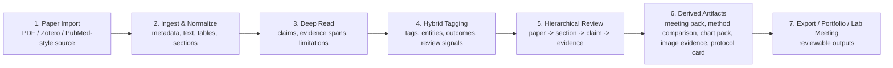
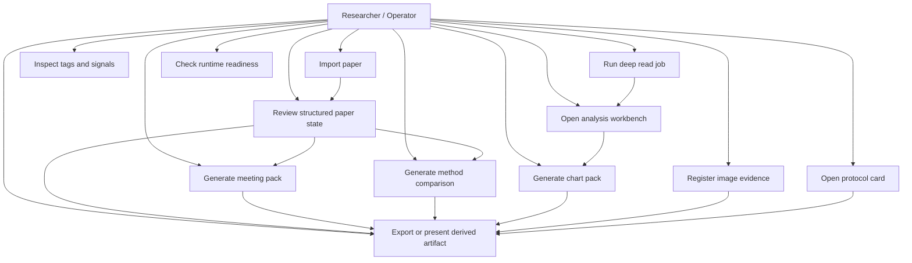
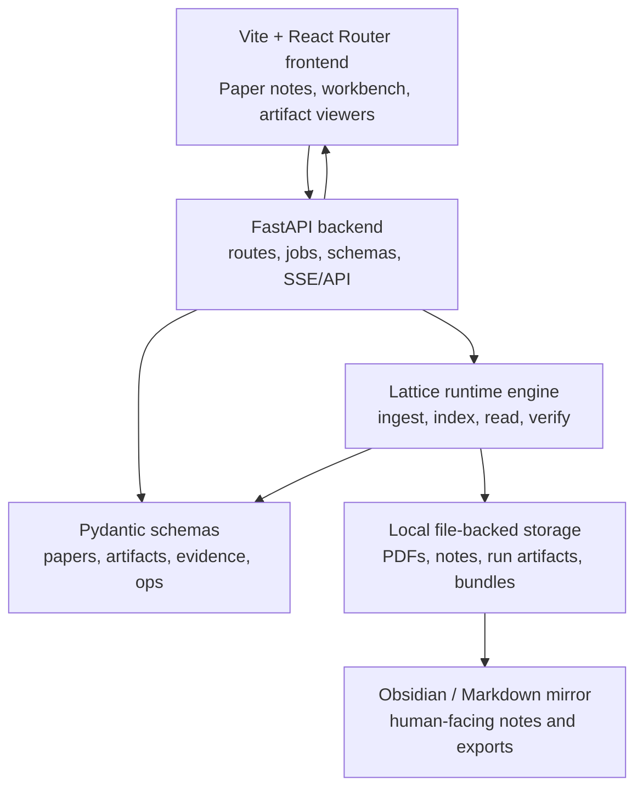
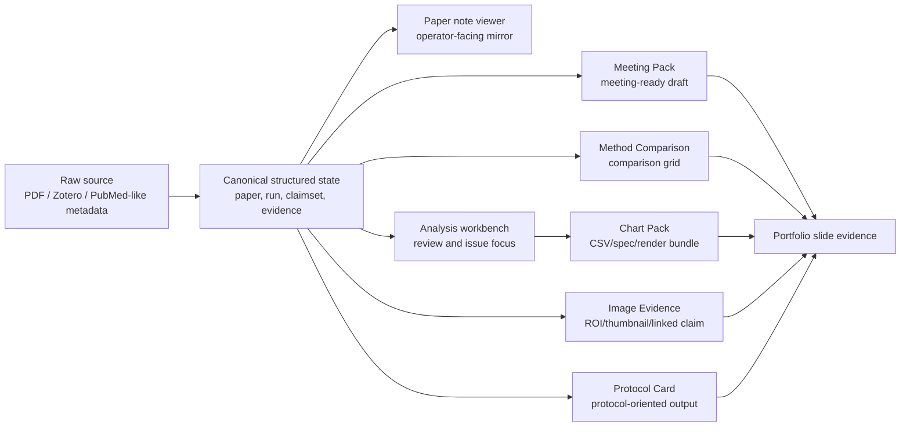
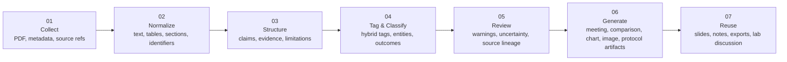

# Lattice 예선 제출 준비 패키지

Date: 2026-05-22
Submission window: 2026-05-23 17:00-17:30
Purpose: 수정된 최종 계획서, 포트폴리오형 설명 슬라이드, 프로토타입 배포 링크 제출 준비

Brand note: 대외 제출명은 `Lattice`로 통일한다. `paperpipe`는 코드/CLI/runtime legacy namespace로만 설명한다.

## 0. 제출 링크 및 데모 증빙

제출 전 아래 빈칸을 실제 값으로 채운다.

| 항목 | 값 |
| --- | --- |
| Final deployment URL | `TODO: https://...` |
| Local verification URL | `http://127.0.0.1:8000/ui` |
| 권장 첫 진입점 | `/ui` 또는 `/ui/papers` |
| 3분 데모 루트 | `/ui` -> `/ui/papers` -> `/ui/papers/{slug}` -> `/ui/workbench/{paperId}` -> artifact viewer |
| 백업 스크린샷 폴더 | `screenshots/contest-prelim-2026-05-23` |
| 백업 데모 영상 | `TODO: optional video link` |
| 마지막 접속 확인 | `2026-05-22 12:23 KST, local prototype` |

배포 링크 제출 시 첫 화면에서 바로 보이면 좋은 4가지:

- 실제 논문 목록 또는 demo paper entry
- structured state 또는 evidence-linked claim이 보이는 화면
- downstream artifact viewer로 가는 링크
- 로컬 우선/근거 lineage/검토 가능성 메시지

## 1. 제출물 최종 체크리스트

### A. 수정된 최종 계획서

- 문제 정의: 논문을 읽고 정리하는 과정에서 근거, 불확실성, 재사용 가능한 결과물이 분리되는 문제
- 해결 방향: 로컬 우선 paper-centered 연구 워크스페이스
- 핵심 사용자: 개인 연구자, 대학원생, 실험실 단위의 논문 검토 담당자
- 핵심 흐름: 논문 수집 -> 정규화된 구조 상태 -> 하이브리드 태깅/분류 -> 근거 검토 -> 결과물 생성
- 기술 아키텍처: FastAPI backend, Lattice runtime engine, Vite React frontend, schema-backed structured state, file-backed artifacts
- 프로토타입 범위: Paper Notes, Analysis Workbench, Meeting Pack, Method Comparison, Chart Pack, Image Evidence, Protocol Card, Runtime Readiness
- 정량 지표: 저장 논문 수, structured state 보유 논문 수, claim/evidence 수, artifact 수, warning/review-needed 수, export 가능한 bundle 수
- 향후 계획: Research DNA 웹 표면화, 논문 수집 자동화, evidence grounding 강화, portfolio/demo 안정화

### B. 포트폴리오형 설명 슬라이드

- 표지
- 문제와 사용자
- 제품 한 문장
- 핵심 workflow
- 실제 화면 캡처 5-7장
- 기술 아키텍처
- 핵심 기능과 결과물 의존 관계
- 정량화 가능한 성과 지표
- Use case diagram
- 로드맵
- 제출 링크 및 데모 안내

### C. 프로토타입 실제 배포 링크

- 필수: 접속 가능한 URL 1개
- 권장 기본 진입점: `/ui` 또는 `/ui/papers`
- 데모 루트: `/ui` -> `/ui/papers` -> `/ui/papers/{slug}` -> `/ui/workbench/{paperId}` -> artifact viewer
- 제출 전 확인: 첫 화면 로딩, paper list, paper detail, workbench, artifact viewer 중 최소 3개 이상 정상 동작

## 2. 포트폴리오 메인 메시지

### 한 문장 피치

Lattice는 논문 PDF를 단순 요약하는 도구가 아니라, 논문을 수집하고 근거 기반 구조 상태로 정규화한 뒤 미팅 자료, 비교표, 차트, 이미지 근거, 프로토콜 카드 같은 재사용 가능한 연구 결과물로 연결하는 로컬 우선 연구 워크스페이스다.

### 짧은 소개문

연구자는 논문을 읽은 뒤에도 근거 위치, 판단 이유, 한계, downstream 자료를 매번 다시 정리해야 한다. Lattice는 논문 중심의 pipeline을 통해 원문, claim, evidence, warning, artifact lineage를 분리해 저장하고, 사용자가 다시 검토할 수 있는 화면과 결과물로 만든다. 핵심은 빠른 자동화가 아니라, 자동화된 draft와 사람이 신뢰할 수 있는 근거 상태를 구분하는 것이다.

### 표지/홍보 문구 후보

- "From Paper to Evidence-Linked Research Assets"
- "논문을 요약에서 끝내지 않고, 검토 가능한 연구 자산으로 바꾸는 워크스페이스"
- "PDF -> Evidence -> Review -> Reusable Artifacts"
- "로컬 우선, 근거 연결, 재생성 가능한 논문 이해 파이프라인"

## 3. 슬라이드 구성안

### 평가 항목 대응

| 예선 평가 항목 | 슬라이드/문서에서 보여줄 증거 |
| --- | --- |
| 출석 참여도 30% | 별도 출석/수업 참여 증빙에 맡기고, 포트폴리오는 완성도 중심으로 구성 |
| 매주 실습과제물 제출 20% | prototype progression, 실제 화면 캡처, 구현 산출물 링크 |
| 프로젝트 기획안 및 프로토타입 50% | 프로젝트 개요, 기술 아키텍처, 실제 배포 URL, core flow, 실측 지표, 로드맵 |

### 권장 본편 9장 구성

본편은 심사자가 빠르게 이해하도록 9장으로 제한한다. 기술/API 세부와 운영 체크리스트는 appendix로 보낸다.

| 장 | 제목 | 핵심 증거 |
| --- | --- | --- |
| 1 | Lattice | 실제 UI 기반 표지, 배포 URL |
| 2 | Problem | 논문 요약 이후 근거/판단/결과물이 흩어지는 문제 |
| 3 | Solution | PDF -> Evidence -> Review -> Artifacts 한 장 flow |
| 4 | Prototype Flow | 기본화면, 수집, 정규화, 검토, 결과물로 이어지는 화면 4컷 |
| 5 | Core Feature 1: Evidence State | structured state, claim/evidence, warning visibility |
| 6 | Core Feature 2: Hybrid Tagging & Hierarchy | tags/signals, paper -> section -> claim -> evidence |
| 7 | Derived Artifacts | Meeting Pack, Method Comparison, Chart Pack 등 결과물 |
| 8 | Architecture & Stack | FastAPI, Pydantic, React, local file-backed artifacts |
| 9 | Metrics & Roadmap | 실측 숫자 5개 이상, 다음 개발 계획 |

### Appendix 후보

- Use case diagram
- 상세 기술 아키텍처
- API 실측 명령
- 전체 캡처 체크리스트
- 제출 당일 점검표

### 1. 표지

- 제목: Lattice
- 부제: Evidence-linked biomedical research workspace
- 이미지: 어두운 Lattice UI 위에 논문, 근거 카드, artifact bundle이 연결되는 구조
- 하단: 팀명/이름, 제출일, 프로토타입 URL

### 2. 문제 정의

- 논문 요약은 빠르지만 근거와 불확실성이 사라지기 쉽다.
- 연구 노트, 발표 자료, 표/차트, 회의 자료가 서로 분리되어 재작업이 반복된다.
- AI draft를 신뢰 가능한 연구 상태처럼 취급하면 검토 리스크가 커진다.

### 3. 솔루션 개요

- 논문 수집과 저장
- 구조화된 paper state 생성
- claim/evidence/warning 중심 검토
- 근거 lineage를 유지하는 downstream artifact 생성
- 로컬 우선 저장과 재실행 가능성

### 4. 핵심 flow



### 5. 기본 화면

- 화면: Triage Dashboard 또는 Paper Notes List
- 보여줄 포인트:
  - 논문 상태와 작업 진입점
  - import/review/readiness 흐름
  - 여러 artifact viewer로 이어지는 구조

### 6. 논문 수집 장면

- 화면: `/ui/papers#import-pdf`
- 보여줄 포인트:
  - 로컬 PDF import
  - 저장 PDF와 paper note 생성
  - paper_id/slug 기반으로 후속 작업 연결

### 7. 정규화된 상태

- 화면: `/ui/papers/{slug}`
- 보여줄 포인트:
  - properties/frontmatter
  - structured state
  - claim/evidence cards
  - related papers와 references

### 8. 하이브리드 태깅

- 화면: Paper detail 또는 list filter
- 보여줄 포인트:
  - tags, entities, MeSH, outcomes, structured signals
  - 수동 검토와 자동 구조화가 함께 쓰이는 방식
  - AI 결과를 최종 진실로 고정하지 않고 review state로 보존
- 캡처 callout:
  - `Hybrid tags`: 자동 태깅/구조 신호가 논문 검색과 분류에 쓰이는 위치
  - `Review signals`: 확정 지식이 아니라 검토 상태로 남겨지는 warning/issue
  - `Structured only`: 구조화된 논문만 필터링할 수 있는 증거
- 슬라이드 문구:
  - "태그는 단순 키워드가 아니라 evidence review로 연결되는 탐색 신호다."
  - "자동 분류 결과를 그대로 진실로 승격하지 않고, 사람이 검토할 수 있는 상태로 남긴다."

### 9. 계층적 분류

- 화면: Paper detail section navigator 또는 Analysis Workbench
- 보여줄 포인트:
  - paper -> section -> claim -> evidence
  - source locator와 claim highlight
  - evidence가 비어 있거나 약하면 warning/review-needed로 남김
- 캡처 callout:
  - `Paper`: 논문 단위 제목/metadata/properties
  - `Section`: section navigator 또는 note heading
  - `Claim`: claim/evidence card
  - `Evidence`: page, quote, bbox/text locator, rationale
  - `Warning`: weak support, missing location, review-needed state
- 슬라이드 문구:
  - "Lattice는 논문 전체를 한 번에 요약하지 않고, paper -> section -> claim -> evidence 단계로 내려가며 검토한다."
  - "근거가 약하거나 위치가 불확실한 항목은 숨기지 않고 review-needed로 표시한다."

### 10. 결과물로 이어지는 핵심 기능

- Meeting Pack: 논문 상태에서 회의용 초안 생성
- Method Comparison: 여러 논문의 method field를 비교
- Chart Pack: saved run에서 chart-ready bundle 생성
- Image Evidence: 이미지/ROI/derived thumbnail/linked claims 관리
- Protocol Card: protocol-oriented knowledge를 카드화

### 11. Use Case Diagram



### 12. 기술 아키텍처



### 13. 정량화 가능한 지표

실제 제출 슬라이드에는 아래 항목을 앱/스토리지에서 실측한 숫자로 채운다.

| 지표 | 슬라이드 표현 | 수집 방법 |
| --- | --- | --- |
| 저장된 논문 수 | `N papers indexed` | `GET /paper-notes`의 `total` |
| 구조 상태 보유 논문 수 | `N structured papers` | `GET /paper-notes?structured_only=true` |
| claim 수 | `N evidence-linked claims` | paper detail `structured_state.claimset` 합산 |
| evidence 수 | `N evidence spans` | claim evidence 배열 합산 |
| review-needed 수 | `N items need review` | ops summary, warnings, issue flags 합산 |
| meeting pack 수 | `N meeting-ready drafts` | `GET /meeting-packs` |
| method comparison 수 | `N comparison grids` | `GET /method-comparisons` |
| chart pack 수 | `N chart-ready bundles` | `GET /chart-packs` |
| image evidence 수 | `N image evidence bundles` | `GET /image-evidence` |
| protocol card 수 | `N protocol cards` | `GET /protocol-cards` |
| export 가능 산출물 | `CSV / JSON / Markdown / PDF-linked outputs` | artifact viewer export links 확인 |

주의: 실측 전에는 숫자를 확정 문구로 쓰지 말고 `demo dataset 기준` 또는 `prototype run 기준`을 붙인다.

### 실측용 API 체크 명령 후보

프로토타입 서버가 `http://127.0.0.1:8000`에서 동작한다는 가정이다. 배포 환경에서는 host만 바꾼다.

```bash
curl -s http://127.0.0.1:8000/paper-notes | jq '.total'
curl -s 'http://127.0.0.1:8000/paper-notes?structured_only=true' | jq '.total'
curl -s http://127.0.0.1:8000/meeting-packs | jq '.total // (.items | length)'
curl -s http://127.0.0.1:8000/method-comparisons | jq '.total // (.items | length)'
curl -s http://127.0.0.1:8000/chart-packs | jq '.total // (.items | length)'
curl -s http://127.0.0.1:8000/image-evidence | jq '.total // (.items | length)'
curl -s http://127.0.0.1:8000/protocol-cards | jq '.total // (.items | length)'
```

### 슬라이드용 숫자 문장 템플릿

- "Prototype demo 기준, `N`개의 논문 노트 중 `M`개가 structured state를 가진다."
- "`K`개의 claim/evidence 단위를 화면에서 재검토할 수 있다."
- "`A`개의 downstream artifact viewer가 동일한 paper state에서 파생된다."
- "`W`개의 warning/review-needed signal을 숨기지 않고 표시한다."
- "`E`개의 export/download 가능한 bundle로 회의/포트폴리오 자료를 만들 수 있다."

### 2026-05-22 로컬 프로토타입 실측 결과

측정 기준: `http://127.0.0.1:8000`, local prototype, 2026-05-22 12:23 KST.

| 지표 | 값 | 슬라이드 문장 후보 |
| --- | ---: | --- |
| 저장된 논문 노트 | 65 | `Prototype demo 기준 65개의 paper note를 조회할 수 있다.` |
| structured state 보유 논문 | 15 | `15개의 논문이 structured state를 가진다.` |
| evidence-linked claims | 44 | `44개의 claim 단위를 화면에서 재검토할 수 있다.` |
| evidence spans | 45 | `45개의 evidence span이 claim과 연결된다.` |
| action-needed 논문 | 9 | `9개 항목은 review-needed/action-needed로 숨기지 않고 표시된다.` |
| ready claimsets | 12 | `12개의 claimset이 ready 상태로 확인된다.` |
| saved meeting-pack records | 221 | `221개의 saved meeting-pack record를 조회할 수 있다.` |
| method comparisons | 1 | `method comparison grid를 실제 artifact viewer에서 확인할 수 있다.` |
| chart packs | 1 | `chart-ready bundle을 CSV/spec/render 흐름으로 확인할 수 있다.` |
| image evidence bundles | 1 | `이미지 근거 bundle과 handoff/view state를 관리한다.` |
| protocol cards | 2 | `protocol-oriented card artifact를 조회할 수 있다.` |

대표 데모 ID:

- Paper slug: `Efficiency capacity compensation maintenance plasticity emerging concepts in cognitive reserve`
- Paper id: `zotero:barulliEfficiencyCapacityCompensation2013`
- Meeting pack: `meetingpack_20260515T035239623754Z_journal_club_06874005`
- Method comparison: `methodcmp_20260330T081753Z_46782046`
- Chart pack: `chartpack_20260330T081753Z_e439dbd9`
- Image evidence: `imageev_current_runtime_smoke_20260330`
- Protocol card: `protocol_20260401T080535Z_70326b11`

## 4. 캡처해야 할 장면

### 필수 7컷

1. 기본화면: `/ui`
   - 목적: 전체 product surface와 다음 액션을 한 번에 보여줌
   - 저장 파일: `screenshots/contest-prelim-2026-05-23/01-home.png`
2. 논문 목록/수집: `/ui/papers#import-pdf`
   - 목적: PDF import와 paper note entry
   - 저장 파일: `screenshots/contest-prelim-2026-05-23/02-paper-import.png`
3. 정규화된 논문 상태: `/ui/papers/{slug}`
   - 목적: properties, structured state, related/reference panel
   - 저장 파일: `screenshots/contest-prelim-2026-05-23/03-normalized-paper-state.png`
4. 계층적 검토: `/ui/workbench/{paperId}`
   - 목적: claim/evidence/review warning을 paper 단위로 검토
   - 저장 파일: `screenshots/contest-prelim-2026-05-23/04-analysis-workbench.png`
5. Meeting Pack: `/ui/meeting-packs/{packId}` 또는 `/ui/meeting-packs`
   - 목적: 논문 상태가 회의용 draft로 바뀌는 결과
   - 저장 파일: `screenshots/contest-prelim-2026-05-23/05-meeting-pack.png`
6. Method Comparison 또는 Chart Pack
   - 목적: 여러 논문 또는 saved run이 비교/차트 artifact로 변환됨
   - 저장 파일: `screenshots/contest-prelim-2026-05-23/06-method-comparison.png`
   - 저장 파일: `screenshots/contest-prelim-2026-05-23/07-chart-pack.png`
7. Runtime Readiness: `/ui/ready`
   - 목적: 로컬 실행 환경과 검증 가능성 강조
   - 저장 파일: `screenshots/contest-prelim-2026-05-23/08-runtime-readiness.png`

### 슬라이드용 16:9 캡처

full-page 캡처는 내부 검토용으로 보관하고, 실제 슬라이드에는 아래 16:9 viewport 캡처를 우선 사용한다.

| 슬라이드 | 이미지 | 용도 |
| --- | --- | --- |
| 표지 / 제품 첫인상 | `screenshots/contest-prelim-2026-05-23/slide-ready/slide-01-home.png` | Lattice의 전체 작업 진입점 |
| Prototype Flow | `screenshots/contest-prelim-2026-05-23/slide-ready/slide-02-paper-list-import.png` | 논문 목록과 import 진입 |
| Paper Card | `screenshots/contest-prelim-2026-05-23/slide-ready/slide-08-paper-card.png` | paper card의 상태, 태그, check, next action 구조 |
| Evidence State | `screenshots/contest-prelim-2026-05-23/slide-ready/slide-03-paper-detail.png` | structured state와 paper detail |
| Peak 장면 | `screenshots/contest-prelim-2026-05-23/slide-ready/slide-04-workbench.png` | PDF, claim, evidence, warning 동시 노출 |
| Derived Artifact | `screenshots/contest-prelim-2026-05-23/slide-ready/slide-05-meeting-pack.png` | saved paper state에서 meeting-pack record로 이어지는 장면 |
| Derived Artifact | `screenshots/contest-prelim-2026-05-23/slide-ready/slide-06-method-comparison.png` | 여러 논문 비교 결과물 |
| Derived Artifact | `screenshots/contest-prelim-2026-05-23/slide-ready/slide-07-chart-pack.png` | chart-ready bundle |

### 선택 4컷

- Image Evidence: 이미지 근거, ROI, thumbnail, linked claim
- Protocol Card: protocol-oriented output
- Paper detail mobile: responsive viewer 증명
- Chart Pack export link: CSV/spec/render output 증명

## 5. 핵심 기능별 포트폴리오 설명

### Paper Import

- 로컬 PDF 또는 외부 source를 paper state로 가져온다.
- 저장 PDF, note slug, paper_id가 후속 job과 artifact의 연결점이 된다.
- 포트폴리오 문구: "논문을 파일로만 저장하지 않고, 후속 검토와 산출물 생성을 위한 structured entry로 등록한다."

### Normalized Paper State

- metadata, markdown body, structured sidecar, claim/evidence, references를 분리해 관리한다.
- free-form note가 canonical truth를 대체하지 않도록 schema-backed state를 유지한다.
- 포트폴리오 문구: "요약문이 아니라 재검토 가능한 논문 상태를 만든다."

### Hybrid Tagging

- tag, structured signals, entity/outcome/MeSH-style fields, review flags를 함께 사용한다.
- 자동 분류 결과와 사람이 검토할 상태를 구분한다.
- 포트폴리오 문구: "자동 태깅과 검토 신호를 함께 보존해 검색성과 신뢰성을 동시에 높인다."

### Hierarchical Classification

- paper -> section -> claim -> evidence 순서로 논문 이해를 좁혀간다.
- evidence locator와 claim highlight를 통해 판단 근거를 되찾을 수 있다.
- 포트폴리오 문구: "논문 전체를 한 번에 요약하지 않고, 근거 단위로 내려가며 검토한다."

### Artifact Generation

- Meeting Pack, Method Comparison, Chart Pack, Image Evidence, Protocol Card가 paper state에 의존한다.
- derived artifact는 second truth가 아니라 source lineage를 가진 downstream bundle이다.
- 포트폴리오 문구: "한 번 정리한 논문 상태를 회의, 비교, 차트, 이미지 근거, 프로토콜 자료로 재사용한다."

## 6. 결과물 의존 관계



## 6.5 숫자와 화살표가 명확한 발표용 flow 수정본

기존 flow에서 숫자와 화살표 위치가 모호하면, 아래처럼 각 단계 박스의 왼쪽에 번호를 고정하고 화살표를 한 방향으로만 유지한다.



슬라이드 디자인 규칙:

- 번호는 박스 안 좌상단 또는 원형 badge로 고정한다.
- 화살표는 `01 -> 02 -> 03` 한 방향만 사용한다.
- `06 Generate` 아래에 작은 sub-label로 `Meeting Pack / Method Comparison / Chart Pack / Image Evidence / Protocol Card`를 배치한다.
- 숫자는 단계 번호이고, 성능 지표 숫자는 별도 색상/위치에 배치한다.

## 7. 기술 스택

- Backend: FastAPI
- Runtime engine: Python Lattice package, with `paperpipe` legacy CLI/package compatibility
- Contracts: Pydantic schemas under `src/schemas/`
- Frontend: Vite, React, React Router, TypeScript
- Styling: TailwindCSS and Lattice `--pp-*` token system
- Icons/UI primitives: lucide-react, local shadcn-style primitives
- Storage: local file-backed PDFs, artifacts, bundles, Obsidian-compatible markdown mirror
- Jobs/workflow: backend job runner, paper/job/artifact model
- Testing/verification: pytest, Playwright e2e/visual routes, smoke scripts

## 8. 로드맵

### 현재 제출 범위

- 논문 import와 paper notes viewer
- paper detail and analysis workbench
- bounded artifact viewers
- local-first storage and runtime readiness
- evidence/warning/review state visibility

### 다음 1-2개월

- 데모 데이터셋 고정과 public prototype 배포 안정화
- Research DNA를 읽기 중심 UI로 노출
- paper import 온보딩 단순화
- metric dashboard와 submission-friendly stats export

### 다음 3-6개월

- evidence grounding coverage 확대
- 더 강한 section/figure/table locator
- artifact regeneration UX 강화
- 논문 검색/source adapter 확대
- 개인 연구자용 설치 패키지 정리

### 장기

- small lab workflow 지원
- 선택적 cloud sync/deploy
- 외부 reference manager와 export adapter 확대
- evidence-backed answer surface

## 9. 표지 및 홍보 이미지 방향

### 이미지 컨셉

- 어두운 Lattice UI 화면 위에 PDF, evidence cards, chart bundle, meeting pack이 선으로 연결되는 장면
- 중심 시각 요소는 실제 제품 화면이어야 한다.
- 장식용 추상 그래픽보다 "논문이 결과물로 변환되는 화면"을 보여주는 편이 평가 지표에 더 잘 맞는다.

### 생성형 이미지 프롬프트 후보

> Dark, polished biomedical research workspace UI on a laptop screen, showing a paper PDF transformed into evidence cards, claim highlights, chart bundles, and a meeting pack. Local-first research software, precise scientific interface, dark theme, elegant data lineage lines, high credibility, not futuristic fantasy, no people, no fake brand text.

### 실제 제출 권장 구성

- 표지 배경: 실제 `/ui/papers/{slug}` 또는 `/ui/workbench/{paperId}` 스크린샷
- 오버레이: `PDF -> Evidence -> Review -> Artifacts`
- 우측 작은 callout: `Local-first`, `Evidence-linked`, `Reviewable`, `Reusable`

## 10. 제출 전 당일 순서

1. 프로토타입 URL 접속 확인
2. 캡처 7컷 저장
3. 실측 지표 채우기
4. 슬라이드에서 `Lattice`와 `paperpipe` 명칭 정리
   - 대외 제품명은 `Lattice`
   - 코드/CLI legacy 명칭은 `paperpipe`
5. 최종 계획서에 평가 항목별 문단 배치
   - 프로젝트 개요
   - 기술 아키텍처 및 계획
   - 프로토타입 구현도
   - 기획안 전달력
6. 배포 링크, 슬라이드, 최종 계획서를 같은 드라이브 폴더에 업로드
7. 17:00 전에 링크 권한을 `보기 가능`으로 확인

## 11. 슬라이드에 꼭 넣을 체크리스트

- [ ] 제품 한 문장
- [ ] 사용자가 겪는 문제 3개
- [ ] 핵심 workflow diagram
- [ ] 실제 UI 캡처 5장 이상
- [ ] 논문 수집 화면
- [ ] 정규화된 paper state 화면
- [ ] 태깅/분류/structured signals 화면
- [ ] 결과물 artifact 화면
- [ ] Use case diagram
- [ ] 기술 스택
- [ ] 실측 숫자 5개 이상
- [ ] 로드맵
- [ ] 실제 배포 링크
- [ ] "AI 결과는 draft/review-needed로 구분한다"는 신뢰성 메시지
- [ ] "로컬 우선"과 "근거 lineage" 메시지

## 12. 심사 전달력 UX 리뷰

### Quick Review

- 한 화면/슬라이드의 선택지는 6개 이하로 줄인다.
- 첫 3장 안에 문제, 실제 화면, 핵심 결과물을 보여준다.
- 기능 설명보다 "논문을 다시 읽는 시간을 줄이고 근거를 잃지 않는다"는 혜택을 먼저 둔다.
- 제출 링크와 실측 숫자는 appendix가 아니라 본편 1장 또는 9장에 배치한다.
- 생성형 홍보 이미지보다 실제 제품 화면을 표지 중심에 둔다.

### Full Review

P0:

- 배포 URL이 없으면 프로토타입 구현도 평가에서 바로 약해진다. 제출 전 `Final deployment URL`과 `마지막 접속 확인`을 반드시 채운다.

P1:

- `Lattice`를 대외 브랜드로 통일한다. `paperpipe`는 legacy CLI/package compatibility로만 설명한다.
- 하이브리드 태깅과 계층적 분류는 개념 다이어그램이 아니라 실제 캡처 callout으로 증명한다.
- 실측 전 숫자는 쓰지 않는다. 모든 숫자에는 `prototype demo 기준` 또는 `demo dataset 기준`을 붙인다.

P2:

- Use case diagram, API 명령, 전체 체크리스트는 appendix로 옮겨 본편 밀도를 낮춘다.
- 영어 용어는 slide title에만 쓰고, 본문 설명은 한국어 중심으로 둔다.

### 6P Storyboard Context

- Problem: 논문을 읽어도 근거 위치, 판단 이유, downstream 자료가 흩어진다.
- Emotion: 다시 찾고 다시 정리해야 한다는 피로감과 검토 불안.
- Action: PDF를 import하고 paper detail/workbench를 연다.
- Struggle: 자동 요약은 빠르지만 어디서 나온 주장인지 확인하기 어렵다.
- Attempt: claim/evidence/warning이 연결된 structured state를 확인한다.
- Happy Ending: 회의 자료, 비교표, 차트, 이미지 근거를 같은 paper state에서 재사용한다.

### BMAP Diagnosis

- Motivation: 근거를 잃지 않는 논문 정리와 발표 준비 시간 절감이 강한 동기다.
- Ability: 복잡한 architecture 설명은 부담이므로 실제 화면 4컷으로 이해 비용을 낮춘다.
- Prompt: 첫 화면, workflow, artifact 결과물을 초반에 배치해 "이 앱으로 무엇을 할 수 있는지" 즉시 자극한다.

### B.I.A.S Diagnosis

- Block: 기능명이 많으므로 본편 9장으로 제한한다.
- Interpret: `PDF -> Evidence -> Review -> Artifacts`를 반복해 가치를 일관되게 해석하게 한다.
- Act: 제출 당일 순서와 체크리스트로 마지막 실행 장벽을 낮춘다.
- Store: 마지막 장은 배포 링크, 실측 숫자, 로드맵으로 "실제로 작동하는 프로토타입" 기억을 남긴다.

### Peak-End Design Notes

- Peak: workbench에서 claim/evidence/warning이 한 화면에 보이는 장면.
- Pit: 배포 링크가 안 열리거나, 숫자가 비어 있거나, 화면이 로컬 개발용처럼 보이는 순간.
- Transition: 수집 -> 정규화 -> 검토 -> 결과물 생성으로 화면 전환을 고정한다.
- End: "같은 paper state에서 meeting pack, comparison, chart bundle이 나온다"로 마무리한다.

### Concrete Changes

- Slide 1: 실제 UI 표지, 배포 URL, `PDF -> Evidence -> Review -> Artifacts`.
- Slide 4: 기본화면/수집/정규화/workbench 4컷.
- Slide 6: 하이브리드 태깅과 계층 분류 callout.
- Slide 7: Meeting Pack, Method Comparison, Chart Pack 중 2-3개 결과물 캡처.
- Slide 9: 실측 숫자 5개 이상과 1-2개월 로드맵.

### Ethics Check Results

- Regret: 실측하지 않은 성능 숫자나 과장 문구를 넣지 않으면 통과.
- Black Mirror: AI 결과를 review-needed/draft로 구분하므로 과신 유도 위험을 줄인다.
- In Real-Life: Lattice는 사용자의 판단을 대체하는 시스템이 아니라, 근거를 보존하고 검토를 돕는 연구 도우미로 설명한다.

### Next PR-Sized Actions

1. public 배포 URL을 만들고 `Final deployment URL`과 배포 기준 `마지막 접속 확인`을 채운다.
2. `slide-ready` 16:9 캡처 중 5-7컷을 골라 슬라이드에 배치하고 callout 위치를 표시한다.
3. 제출용 Drive 폴더에 계획서, 슬라이드, public URL, 백업 스크린샷 폴더를 함께 올린다.
